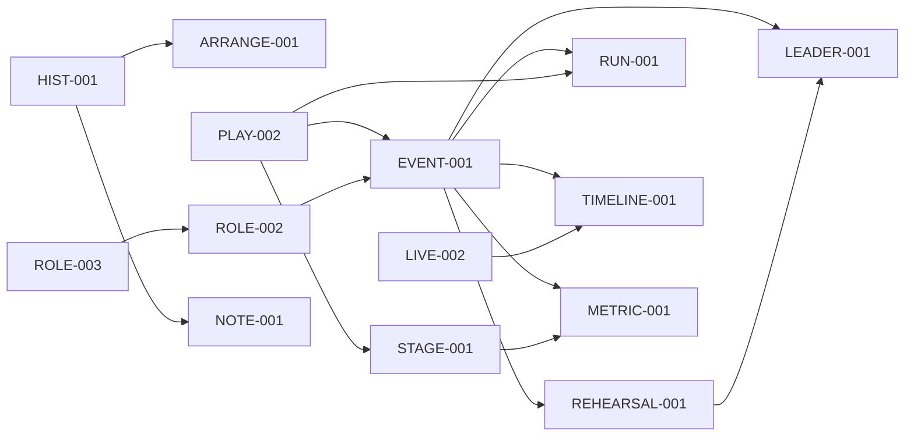

# Backlog de evolução do Cifrô

Data-base: 2026-08-10

## Estado da estabilizacao em 2026-08-20

**Resultado confirmado:** as suites funcionais e unitarias estao 100% verdes. A certificacao final dos gates de cobertura ficou pendente porque a execucao longa foi interrompida a pedido do responsavel para economizar creditos; a interrupcao nao foi falha de teste.

- E2E completo: **1.072 passaram, 0 falharam, 0 retries e 3 skips condicionais** (checkout Stripe real sem credenciais externas).
- Unitarios: **621 passaram** — PHPUnit: 579 testes/1.482 assertions; Node: 42 testes.
- Diagnosticos ocultos passaram a registrar `console`, `pageerror`, `requestfailed` e HTTP 5xx por projeto em `logs/e2e/browser-*.jsonl`.
- Gate PHP final interrompido: PHPUnit passou 579/579 e o primeiro lote Cifro passou 18/18; faltam os demais lotes e o calculo do percentual de branches.
- Gate JS de cobertura: ainda precisa da execucao final apos as correcoes.
- Portanto, **nao declarar cobertura 100% ainda**. O comportamento funcional testado esta verde; falta somente concluir a certificacao dos gates de cobertura e revisar os poucos diagnosticos residuais nao classificados.

Comandos para retomar:

```powershell
npm run test:coverage:php
npm run test:coverage:all
```

Principais estabilizacoes feitas:

- execucao E2E completa em processos isolados, sem retries;
- captura centralizada de erros silenciosos do navegador e logs JSONL;
- isolamento de autenticacao e esperas explicitas de prontidao nas telas de musica/editor;
- correcoes de flakes em sessao expirada, palco/Live, roteiro e layout visual;
- lotes menores para cobertura PHP, porta dinamica e supervisor do servidor PHP/Xdebug para evitar `ERR_CONNECTION_REFUSED`;
- envio real de e-mail bloqueado durante cobertura;
- caminhos e limpeza de memoria do runner PHPUnit/Xdebug corrigidos.

Comando de auditoria funcional ja aprovado:

```powershell
npx cross-env E2E_AUDIT_DIAGNOSTICS=1 npm run test:e2e:full
```

## Objetivo

Este backlog descreve as próximas evoluções de produto. A prioridade favorece melhorias no fluxo principal do Cifrô: preparar a banda, organizar o repertório, ensaiar e executar uma apresentação com segurança.

A seção **Dívida técnica** no final registra o que sustenta essas evoluções. Ela existe porque a premissa original deste documento — de que os impeditivos técnicos e operacionais já estariam resolvidos — se mostrou falsa em 2026-08-13: quatro defeitos quebravam produção em silêncio. Enquanto os itens P1 dessa seção estiverem abertos, entregas de produto correm o risco de repetir o mesmo tipo de incidente.

## Convenções

- Prioridade: P1 alta, P2 média, P3 posterior.
- Complexidade: XS, S, M, L ou XL.
- Cada item deve ser entregue em alterações pequenas, funcionais e reversíveis.
- Alterações de conteúdo devem respeitar `banda_id`, papéis, CSRF, revisão de sincronização e comportamento offline.
- Funcionalidade escondida na interface não é considerada autorização; toda permissão deve existir no backend.

## Perguntas em aberto

- **Categorias na criação de banda.** Ao apagar `migrate_categorias.php` (ver "Resolvido em 2026-08-14"), ficou exposto que o script antigo semeava cinco categorias fixas — "Louvor Animado", "Marianas", "Oracionais", "Adoração", "Missa" — em toda banda nova. Essa semeadura não foi levada para a migration de absorção: não é schema, não é dado a preservar, e os nomes não existem em nenhum outro lugar do app. Consequência real, não hipotética: banda criada hoje nasce sem categoria nenhuma. Se um ponto de partida assim faz falta, o lugar certo é o fluxo de criação de banda, não uma migration de dados. Pergunta em aberto, não item decidido.

## Ordem recomendada

| Ordem | ID | Funcionalidade | Tipo | Prioridade | Complexidade | Dependências principais |
|---:|---|---|---|---|---|---|
| 1 | HIST-001 | Histórico e versionamento de cifras | Ampliação | P1 | L | Sync e revisão de conteúdo |
| 2 | PLAY-002 | Repertórios avançados | Ampliação | P1 | L | Playlists atuais |
| 3 | ~~STAGE-001~~ | ~~Verificação e autorrecuperação offline~~ | Implementado 19/08 | P1 | M | PWA e sync existentes |
| 4 | LIVE-002 | Live confiável e coordenado | Ampliação | P1 | L | Live atual e observabilidade |
| 5 | ROLE-003 | Convite da banda por link compartilhável | Nova | P1 | M | Perfis, bandas e limites de plano |
| 6 | ROLE-002 | Convites e convidados externos | Ampliação | P1 | M | ROLE-003 |
| 7 | EVENT-001 | Agenda de eventos | Nova | P1 | L | Repertórios, roteiros e membros |
| 8 | IMPORT-001 | Importação de cifras em lote | Ampliação | P1 | L | Importação individual |
| 9 | REHEARSAL-001 | Central de ensaio | Ampliação | P2 | L | Modo Ensaio e eventos |
| 10 | NOTE-001 | Anotações pessoais por músico | Nova | P2 | M | Cifras e sync |
| 11 | HELP-001 | Ajuda contextual | Implementada | P2 | M | PHPUnit + Playwright real |
| 12 | ARRANGE-001 | Biblioteca de arranjos | Nova | P2 | XL | Histórico de cifras |
| 13 | RUN-001 | Roteiro executável de apresentação | Ampliação | P2 | L | Eventos, repertórios e roteiros |
| 14 | LEADER-001 | Painel do líder | Nova | P2 | L | Eventos, ensaio e métricas |
| 15 | TIMELINE-001 | Histórico da banda | Nova | P3 | M | Eventos de domínio |
| 16 | METRIC-001 | Métricas úteis para a banda | Nova | P3 | M | Eventos e analytics |

## Mapa de dependências



## HIST-001 — Histórico e versionamento de cifras

### Problema

Uma edição incorreta pode substituir conteúdo válido. Edições concorrentes também podem gerar conflito sem oferecer ao usuário uma forma clara de comparar ou recuperar versões.

### Valor para o usuário

Permitir que a banda edite cifras com segurança, entenda o que mudou e recupere uma versão anterior sem depender de backup ou suporte.

### Escopo inicial

1. Criar uma versão a cada alteração efetiva de cifra.
2. Registrar música, banda, autor, data, revisão e conteúdo anterior.
3. Listar versões em ordem decrescente.
4. Comparar metadados e conteúdo entre duas versões.
5. Restaurar uma versão antiga como uma nova versão.
6. Informar conflito quando a revisão enviada não for a atual.
7. Incluir histórico na exclusão da banda e na exportação aplicável.

### Fora do escopo inicial

- edição simultânea em tempo real;
- merge automático de texto musical;
- histórico ilimitado sem política de retenção;
- exposição do histórico a usuários sem acesso à banda.

### Regras de negócio

- Somente gestor, administrador ou master pode editar/restaurar.
- Usuário básico e externo podem visualizar somente se essa capacidade for explicitamente habilitada; o padrão inicial é não exibir.
- Restaurar nunca altera uma versão antiga: cria uma nova versão atual.
- Nenhuma versão pode atravessar o limite de `banda_id`.
- Uma gravação sem mudança real não cria versão.
- O endpoint deve exigir a revisão esperada para evitar sobrescrita silenciosa.

### Fluxo de interface

1. Usuário abre a cifra.
2. Seleciona “Histórico”.
3. Visualiza data, autor e resumo das versões.
4. Escolhe uma versão para comparar com a atual.
5. Seleciona “Restaurar esta versão”.
6. Confirma a ação.
7. A aplicação cria nova versão, atualiza a cifra e sincroniza os dispositivos.

### Backend e API

- Criar `SongVersionService` e `SongVersionRepository`.
- Integrar a criação da versão à mesma transação da edição.
- Criar endpoints para listar, obter, comparar e restaurar.
- Paginar a listagem e limitar o tamanho das respostas.
- Registrar evento operacional de restauração sem armazenar a cifra no log.

### Banco

Tabela sugerida `musica_versoes`:

- `id`;
- `banda_id`;
- `musica_id`;
- `revision`;
- `autor_usuario_id` nullable;
- `nome`, `artista`, `classificacao`, `bit`, `cifra`;
- `criado_em`;
- índice por `banda_id`, `musica_id`, `id`;
- FKs com comportamento definido para exclusão da música, banda e usuário.

### Offline e sincronização

- A cifra restaurada entra no sync normal.
- O histórico completo não precisa ser armazenado offline no MVP.
- A restauração deve invalidar a revisão anterior e propagar somente a música alterada.

### Segurança e privacidade

- Validar banda na consulta e não aceitar `banda_id` como autorização.
- Escapar todo conteúdo na comparação.
- Não registrar conteúdo em logs.
- Definir como anonimizar ou preservar autoria após exclusão de conta.

### Testes necessários

- unitários de criação, ausência de mudança, listagem e restauração;
- integração transacional: edição e versão confirmam ou falham juntas;
- API sem autenticação, CSRF, papel insuficiente, outra banda e versão inexistente;
- E2E de edição, comparação e restauração;
- concorrência com duas abas e dois navegadores;
- regressão de sync incremental e offline.

### Critérios de aceite

- Toda edição efetiva gera exatamente uma versão recuperável.
- Uma falha ao salvar a versão impede a edição principal.
- Restaurar cria nova versão e atualiza dispositivos conectados.
- Nenhum usuário acessa histórico de outra banda.
- A comparação renderiza conteúdo malicioso como texto seguro.

### Migração e rollback

- Migration aditiva sem backfill obrigatório.
- Rollout por feature flag.
- Rollback desabilita gravação/UI sem apagar versões já armazenadas.

### Documentação

Atualizar catálogo, API, modelo de dados, músicas/cifras, sync, privacidade e rastreabilidade.

## PLAY-002 — Repertórios avançados

### Problema

O repertório atual organiza músicas, mas ainda exige trabalho manual para duplicação, preparação de eventos, ajustes de tom, instruções e compartilhamento.

### Valor para o usuário

Reduzir o tempo entre escolher músicas e ter um repertório pronto para ensaio ou apresentação.

### Escopo inicial

1. Duplicar repertório existente.
2. Criar repertório a partir de template.
3. Reordenar músicas por arrastar e por teclado.
4. Definir tom, duração estimada e observação por item.
5. Calcular duração total.
6. Marcar itens como confirmados ou pendentes.
7. Compartilhar resumo por Web Share API ou cópia formatada.
8. Exportar versão imprimível.

### Fora do escopo inicial

- agenda completa de eventos;
- arranjos independentes da música;
- aprovação formal por múltiplos integrantes;
- integração externa com calendários.

### Regras de negócio

- A duplicação cria novo repertório sem vínculo vivo com o original.
- Ordem e metadados pertencem ao repertório, não alteram a música.
- Data de validade continua determinando exibição quando configurada.
- Duração total ignora itens sem duração e sinaliza estimativa incompleta.
- Somente gestor ou superior edita; demais perfis consultam.

### Fluxo de interface

1. Usuário cria, duplica ou seleciona um template.
2. Adiciona músicas por busca.
3. Ajusta ordem, tom, duração e notas.
4. Confere pendências e duração total.
5. Salva.
6. Compartilha ou prepara para o palco.

### Backend e API

- Consolidar contrato de playlist/repertório.
- Criar ações explícitas para duplicação e template.
- Validar todos os IDs de música na banda atual.
- Atualizar revisão de conteúdo na mesma transação.
- Evitar gravação parcial da ordem.

### Banco

Preferência inicial: evoluir o JSON `playlists.itens` com leitura retrocompatível.

Campos sugeridos por item:

- `musica_id`;
- `ordem`;
- `tom`;
- `duracao_segundos`;
- `observacao`;
- `status`.

Se consultas agregadas se tornarem necessárias, migrar posteriormente para `playlist_itens` normalizada.

### Offline e sincronização

- Repertório e metadados devem estar no snapshot offline.
- Alteração deve gerar evento incremental `playlist/replace`.
- Share offline usa dados locais e URL quando disponível.

### Segurança

- Sanitizar notas e nomes.
- Impedir IDs de músicas externas à banda.
- Não incluir dados privados no texto compartilhado sem ação explícita.

### Testes necessários

- duplicação, template, reordenação, teclado e mobile;
- tom/duração/notas/status;
- cálculo total e valores ausentes;
- permissões e tenant isolation;
- F5, offline, sync e conflito;
- compartilhamento nativo e fallback.

### Critérios de aceite

- Repertório duplicado pode ser editado sem alterar o original.
- Ordem e metadados permanecem após F5 e offline.
- Duração total é reproduzível.
- Share funciona em mobile e desktop.
- Toda operação respeita papel e banda.

### Migração e rollback

- Versão do JSON com defaults para registros antigos.
- UI nova pode ser desabilitada mantendo leitura do formato anterior.

### Documentação

Atualizar setlists/roteiros, API, modelo de dados, offline e testes.

## STAGE-001 — Verificação automática e autorrecuperação offline

**Estado:** implementado em 2026-08-19. As nove pendências abaixo estão fechadas;
o texto original fica preservado como registro do que faltava.

### O que estava errado, medido antes de existir correção

O teste que abriu o trabalho falhou assim: `cifroSync.sync()` **devolveu
sucesso** e o repertório não estava no aparelho. Apagando só o
`cifro_snapshot_current` e deixando o `cifro_sync_meta` — o dano que o
navegador causa sob pressão de armazenamento —, a revisão continuava batendo e
a sincronização encerrava dizendo "tudo certo". Sem internet depois disso, o
músico sobe ao palco sem cifra.

E o reparo, sem limite, custava caro: **três sincronizações = três downloads do
repertório inteiro**. Num aparelho que não consegue gravar (quota estourada,
modo privativo), isso é um `data.php` por página aberta, contra a Hostinger.

### Como ficou

- **Portão de integridade** (`verificarIntegridade`): uma transação readonly
  que prova existência com `getKey()` — devolve a chave sem desserializar o
  valor, então **o custo não cresce com o repertório**: medido 0,38 ms com 50
  músicas e 0,38 ms com 600. Confere pertencimento (`actual_band_id` e usuário),
  igualdade de revisão entre snapshot/meta/banda, forma das coleções, e
  contagens gravadas por `writeSnapshot` no `cifro_sync_meta` — que pegam o
  snapshot que existe, tem a revisão certa e está vazio por dentro.
  Ausência de `contagens` **não** é dano: é snapshot de versão anterior do app,
  e exigi-la mandaria toda a base baixar tudo no primeiro acesso após o deploy.
- **Reparo online:** revisão igual + integridade falha cai no `data.php` que já
  existia. O reparo é o full sync de sempre — transacional, e já promovendo
  `current → previous`. Por isso a pendência 4 não custou código novo.
- **Reparo offline:** `rebuildSnapshotFromRows` → `restorePreviousSnapshot` →
  aviso. A guarda da primeira etapa é o ponto delicado: só reconstrói quando as
  linhas de origem **existem**. Se a que sumiu for a `cifro_musicas`,
  reconstruir "do que sobrou" produziria um repertório vazio que passa em toda
  validação, e o `writeSnapshot` empurraria o snapshot bom para `previous` —
  perdendo-o no ciclo seguinte. Array vazio numa banda nova é dado legítimo;
  linha ausente não é.
- **Limitador e aviso na mesma marca** (`sessionStorage`, por usuário:banda):
  uma tentativa de reparo e um aviso por sessão do navegador, limpos no
  sucesso. A marca é gravada **antes** da tentativa: um reparo interrompido por
  queda de rede queima a tentativa da sessão, o que é assimetricamente melhor
  que um punhado de aparelhos batendo em `data.php` sem parar.
- **Fronteira:** `cifro-sync.js` decide e repara; ele despacha
  `cifro:integridade-falhou` e não conhece toast nem DOM. `offline-tools.js`,
  dono do painel, escuta e mostra.

### Cache Storage (pendências 8 e 9)

`populateStatic` e `preparePages` faziam `if (await cache.match(url)) continue;`
— presença tratada como validade. Entrada cacheada com o tipo errado (HTML de
login no lugar do script) criava um laço que nunca fechava: a verificação
acusava o asset como faltante, a preparação pulava a entrada inválida, e a
verificação seguinte acusava de novo. Agora revalida e substitui, o que não
custa no caminho comum porque a preparação só roda depois de a verificação já
ter falhado.

### Dedupe da conferência — e a armadilha que quase entrou

A auditoria do Cache Storage (47 assets + 4 páginas, com leitura do corpo de
cada HTML) custa **6,81 ms** medidos no desktop e rodava **de duas a três vezes
por carregamento**: `bind()` do offline-tools, `cifro:sync-checked` e
`renderStatus`. `verifyOfflinePackage` passou a memorizar o resultado por 5 s,
com `{ force: true }` para quem precisa do estado real do disco.

**Só sucesso é memorizado, e a assimetria é o ponto todo.** A primeira versão
guardava qualquer resultado e quebrou seis testes — três regressões reais.
Causa raiz única: `performPreparation` prepara o pacote e então confere; com a
falha memorizada, ele lia o estado de **antes do próprio conserto**, concluía
"o pacote continuou incompleto após a recuperação" e desistia. O laço que
existe para reparar ficava travado pela memória de que estava quebrado. Um
pacote íntegro continua íntegro (fora do app, nada mexe no Cache Storage); um
pacote quebrado é justamente o que se está tentando mudar.

**Lição transferível:** memorizar o resultado de uma verificação que existe
para disparar um conserto envenena o conserto. Cacheie o estado estável, nunca
o transitório.

### Custo, medido

| Operação | Medido (desktop, cache quente) | Cresce com o repertório? |
|---|---:|---|
| Auditoria do Cache Storage | 6,81 ms | não |
| `getKey()` nas 8 stores + 2 linhas pequenas | 0,33–0,50 ms | **não** |
| `get()` do snapshot (300 / 600 músicas) | 0,82 / 3,15 ms | sim |
| `get()` das 6 stores de dados | 0,48–1,57 ms | sim |

A contagem cruzada contra a store `cifro_musicas` foi **descartada** por medição:
custava uma segunda desserialização do repertório, e o caso que ela pegaria (o
`applyMutation` interrompido entre suas duas transações) já é pego de graça
pela igualdade de revisão. As contagens gravadas no meta dão o mesmo alcance a
custo zero. O `loadCached` também passou a aceitar o snapshot já lido pelo
portão, para o caminho quente não desserializar o repertório duas vezes.

### Resultado da reauditoria

| Requisito | Estado | Evidência | Pendência |
|---|---|---|---|
| Auditar fisicamente o Cache Storage | Concluído | `VERIFY_OFFLINE` abre os caches reais, valida presença, tipo e conteúdo mínimo dos assets e páginas essenciais. | Ampliar somente se novos recursos passarem a ser obrigatórios. |
| Auditar fisicamente o IndexedDB | Parcial | O código lê `cifro_bandas`, `cifro_sync_meta` e `cifro_snapshot_current` e confere arrays, revisão e marcadores. | A sincronização ainda aceita revisão igual sem exigir que o snapshot e as linhas físicas estejam íntegros. |
| Reparar automaticamente recursos ausentes | Parcial | Assets e páginas removidos do Cache Storage são reconstruídos silenciosamente quando o servidor está disponível. A perda total do IndexedDB, sem metadados, provoca snapshot completo. | Perda parcial do IndexedDB pode manter `cifro_sync_meta`; nesse caso, revisão igual encerra a sincronização sem reconstruir os dados ausentes. Uma entrada de cache presente, mas inválida, é detectada e depois ignorada pela preparação porque já existe. |
| Não confiar apenas em marcadores de revisão | Parcial | O estado do shell combina marcador e inspeção física do Cache Storage. | A decisão de não baixar dados ainda pode depender somente de `cifro_sync_meta.content_revision`. |
| Atualizar imediatamente a cifra aberta | Concluído | A aplicação emite `cifro:sync`; `music.php` substitui título, artista e cifra sem recarregar o documento. | Manter o teste E2E como regressão obrigatória. |
| Corrigir o teste PWA para a página genérica | Concluído com dívida de teste | O teste de preparação confirma que nenhuma página individual é baixada e que `/music.php` genérica está no cache. | Remover a expectativa antiga de banner/HTML imutável em `26-offline-sync.spec.js`, incompatível com a atualização imediata atual. |
| Avisar somente se a recuperação falhar | Concluído | A preparação automática é silenciosa em caso de sucesso e mostra um único aviso por sessão somente quando não consegue reparar. | Adicionar teste explícito para sucesso silencioso e falha com aviso único. |
| Manter o acesso ao reabrir o PWA offline | Concluído | O shell autenticado e o snapshot local não dependem do cookie PHP para leitura offline. O E2E remove todos os cookies, fecha a página, ativa modo offline e reabre pelo `start_url`. | Continua condicionado à preservação do armazenamento do site pelo navegador. |
| Exibir splash profissional somente no aplicativo instalado | Concluído | Detecção por modo standalone, dissolução orgânica, execução única por sessão, suporte offline, fail-safe e respeito a movimento reduzido. | Reavaliar duração e intensidade somente com feedback de uso em aparelhos reais. |

### Pendências para concluir STAGE-001 — todas fechadas em 2026-08-19

Cobertas por 12 testes novos e um atualizado: oito em
`tests/cifro/79-integridade-offline.spec.js`, três em `26-offline-sync.spec.js`
(entrada de cache corrompida; memo da conferência; página cacheada inválida) e
um em `76-capotraste-pessoal.spec.js`.

**Vale distinguir como cada um foi obtido, porque o grau de garantia difere.**
Os seis primeiros do `79` e o da entrada de cache corrompida nasceram
vermelhos, antes do código. Os três últimos (perda de uma única coleção,
página cacheada inválida, e o memo) foram escritos depois; a garantia deles vem
de A/B — neutralizando a mudança correspondente, todos falham. Os dois
restantes são de caracterização, travando comportamento que já existia: a
asserção de que o documento **não** foi recriado no teste de mudança remota
(pendência 6, que pedia atualizar o teste legado), e o do
`76-capotraste-pessoal.spec.js`, rede de proteção para o refactor da leitura
dupla — ele cobre o cenário que faltava, escolha pessoal chegando com a revisão
da banda **parada**, que é o caminho de "nada mudou" e o mais percorrido do app.

Um episódio merece registro: o teste do aviso na tela **passou de primeira**,
porque o seletor casava com um toast genérico que o `offline-tools` já emitia.
Foi reescrito com o texto exato para ficar vermelho antes. Teste que nasce
verde não prova nada — e num arquivo onde o service worker é bloqueado, sobram
mensagens genéricas para casar por acidente.

1. Criar uma verificação única de integridade física do IndexedDB antes de aceitar uma revisão inalterada.
2. Considerar íntegro somente quando snapshot atual, metadados, banda e coleções obrigatórias existirem, pertencerem ao usuário/banda e tiverem a mesma revisão.
3. Quando a revisão for igual, mas o IndexedDB estiver parcial ou inválido, baixar `/api/sync/data.php` e regravar o snapshot de forma transacional.
4. Preservar o snapshot anterior até a validação e gravação completas do novo snapshot.
5. Criar E2E removendo somente `cifro_snapshot_current`, somente uma coleção obrigatória e mantendo `cifro_sync_meta`; todos devem se recuperar automaticamente.
6. Atualizar o teste legado de mudança remota para esperar a cifra nova sem reload e confirmar que o documento não foi recriado.
7. Criar E2E de falha de recuperação comprovando preservação do snapshot anterior e exibição de um único aviso.
8. Durante a reparação do Cache Storage, validar novamente entradas existentes e substituir as inválidas em vez de ignorá-las.
9. Criar E2E com asset e página presentes, porém inválidos, confirmando sua substituição automática.

### Problema

O aplicativo já baixa todas as cifras no primeiro acesso, sincroniza alterações por revisão e usa uma página genérica para abrir qualquer música offline. A lacuna era confiar em marcadores de preparação sem conferir se o navegador ainda mantinha fisicamente o Cache Storage e o snapshot do IndexedDB.

### Valor para o usuário

Manter o funcionamento offline automático e impedir que a aplicação informe prontidão quando arquivos locais tiverem sido removidos.

### Escopo inicial

1. Verificar automaticamente a integridade do snapshot no IndexedDB.
2. Conferir a existência real dos assets e páginas essenciais no Cache Storage.
3. Reparar automaticamente recursos ausentes quando houver servidor disponível.
4. Manter o último snapshot válido quando a recuperação falhar.
5. Atualizar uma cifra aberta assim que uma alteração remota for sincronizada.
6. Avisar o usuário somente quando a autorrecuperação não puder ser concluída.
7. Manter a sincronização manual apenas como ação de diagnóstico e nova tentativa.
8. Atualizar o service worker também na landing e no login, aguardando sua ativação antes de concluir a autenticação.

### Fora do escopo inicial

- download de áudio protegido;
- garantia de bateria, espaço ou conectividade oferecida pelo sistema operacional;
- botão obrigatório de preparação por repertório;
- cache de uma página HTML diferente para cada cifra.

### Regras de negócio

- A revisão do servidor não comprova sozinha a integridade do armazenamento local.
- “Pronto” exige snapshot íntegro, service worker disponível, assets e páginas essenciais presentes.
- A perda total do IndexedDB força novo snapshot; a perda do Cache Storage força reconstrução do shell.
- A recuperação é automática e não depende de ação prévia do usuário.
- Uma nova versão instalada substitui o worker anterior sem exigir desinstalação do PWA.
- Cada usuário e dispositivo possui estado local isolado.
- Fechar o site/PWA ou expirar a sessão HTTP não expira o acesso ao conteúdo local preparado.
- Não existe prazo de uma semana ou outro TTL para o acesso offline; ele permanece enquanto Cache Storage, IndexedDB e service worker forem preservados.
- Sessão do servidor continua obrigatória para sincronizar, cadastrar ou alterar dados após a conexão voltar.

### Fluxo-alvo

1. Usuário abre qualquer página autenticada.
2. O sistema compara a revisão local com a revisão do servidor.
3. O sistema audita IndexedDB e Cache Storage.
4. Recursos ausentes são reconstruídos silenciosamente.
5. Se não houver recuperação possível, o usuário recebe orientação para sincronizar novamente.

### Backend e frontend — situação atual

- Concluído: reutilização dos endpoints de revisão, delta e snapshot existentes.
- Concluído: `VERIFY_OFFLINE` no protocolo do service worker.
- Concluído para Cache Storage: `canUseOffline`, `getOfflineStatus` e `getSyncStatus` validam assets e páginas reais.
- Parcial para IndexedDB: esses métodos leem o snapshot real, mas `sync()` ainda pode aceitar revisão igual com armazenamento parcial.
- Concluído: preparação previamente marcada não evita a nova conferência física dos caches.
- Concluído: página genérica `music.php`; as cifras continuam vindo do snapshot completo.

### Banco e armazenamento local

- Nenhuma tabela nova no servidor.
- IndexedDB mantém snapshot atual, anterior, revisão e marcadores.
- Cache Storage mantém shell, páginas essenciais e metadados do service worker.

### Segurança e privacidade

- A verificação exige contexto compatível com o usuário autenticado.
- O snapshot permanece isolado por usuário e banda.
- Logout e troca de conta não podem expor conteúdo de outro usuário.

### Cobertura de testes auditada

- Coberto: primeira sincronização e deltas de criação, edição e exclusão.
- Coberto: página genérica `music.php` no cache sem baixar uma página por cifra.
- Coberto: remoção do cache de páginas com reconstrução automática.
- Coberto: cifra aberta recebendo alteração remota sem recarregar o documento.
- Coberto: fechamento e reabertura offline sem qualquer cookie de sessão, preservando usuário, banda e cifras locais.
- Coberto: splash ausente no navegador comum, presente somente em standalone, execução única, movimento reduzido, celular, tablet e lançamento offline.
- Coberto em outro cenário: atualização do service worker e preservação do IndexedDB legado.
- Pendente: perda parcial do IndexedDB com metadados e revisão ainda presentes.
- Pendente: falha de recuperação preservando comprovadamente o snapshot anterior.
- Pendente: aviso único somente após falha automática e ausência de aviso no sucesso.
- Pendente: atualizar o teste legado que ainda espera a cifra antiga e `#cifroSongUpdate`.
- Cobertura existente a manter: troca de banda/usuário, subdiretório e login com worker antigo.

### Critérios de aceite — estado

- Atendido: o status offline fica falso quando um cache obrigatório é removido, mesmo que a revisão não mude.
- Atendido: com servidor disponível, o shell removido é reconstruído automaticamente.
- Atendido: todas as cifras do snapshot abrem offline sem visita individual anterior.
- Atendido: uma cifra aberta recebe o conteúdo remoto novo após a sincronização.
- Atendido: reabrir o PWA offline depois do encerramento da sessão do servidor não exibe login nem landing.
- Parcial: falha de recuperação mantém o snapshot anterior pelo desenho transacional, mas falta E2E específico.
- Não atendido para perda parcial: IndexedDB incompleto com revisão igual pode não ser reconstruído.
- Atendido com cobertura existente: após publicar uma versão, o login abre a aplicação atualizada sem reinstalação.

### Validação da reauditoria

Comando executado:

`npx playwright test tests/cifro/26-offline-sync.spec.js tests/cifro/61-incremental-song-sync.spec.js --grep "deduplica|detecta remo|cifra aberta|mudan.a remota"`

Resultado: 5 testes passaram e 1 falhou. Passaram a página genérica, a reconstrução física do Cache Storage e a atualização da cifra aberta. Falhou o teste legado de `26-offline-sync.spec.js`, que ainda exige uma requisição de snapshot completo, preservação da cifra antiga e o elemento `#cifroSongUpdate`; o comportamento atual usa delta e atualiza a cifra imediatamente.

Validação adicional: `npx playwright test tests/cifro/66-offline-persistent-login.spec.js` passou com 2 de 2 testes, incluindo o setup. O cenário remove todos os cookies, fecha o aplicativo e o reabre sem internet, comprovando que a leitura offline não depende da sessão do servidor.

### Rollback

Remover a auditoria automática preservando os endpoints e o mecanismo de sincronização anterior.

### Documentação

Atualizar PWA/offline, arquitetura, testes e guia operacional.

## LIVE-002 — Live confiável e coordenado

### Problema

O Live sincroniza estado, mas apresentações reais precisam de presença, controle exclusivo, transferência de host e recuperação clara após instabilidade.

### Valor para o usuário

Evitar dois líderes concorrentes e manter todos orientados durante a apresentação.

### Escopo inicial

1. Mostrar host atual e participantes conectados.
2. Implementar lease de host com expiração.
3. Impedir dois hosts ativos simultaneamente.
4. Permitir transferência e liberação de controle.
5. Exibir música atual e próxima música.
6. Reconectar automaticamente e indicar estado degradado.
7. Registrar início, término e falhas da sessão.

### Fora do escopo inicial

- áudio/vídeo em tempo real;
- chat;
- edição colaborativa da cifra;
- comunicação peer-to-peer.

### Regras de negócio

- Uma banda possui no máximo um lease ativo.
- Lease expira sem heartbeat.
- Transferência exige confirmação do host atual ou expiração.
- Perfil externo acompanha, mas não hospeda.
- A próxima música vem do repertório ativo quando existir.

### Backend e API

- Evoluir `LiveStateService` e repository.
- Criar operações `claim`, `renew`, `transfer`, `release` e `presence`.
- Usar versão/compare-and-swap ou transação para exclusividade.
- Respostas incluem horário do servidor e expiração do lease.

### Frontend

- Indicador de host, seguidores, conexão e expiração.
- Controles de transferência/liberação.
- Próxima música acessível sem cobrir a cifra.
- Reconexão com backoff e sem múltiplos polling loops.

### Banco

Evoluir `live_state` ou criar `live_sessions` e `live_presence` conforme retenção desejada.

### Segurança

- Autorização por capacidade explícita.
- Isolamento por banda.
- IDs de host imprevisíveis e não reutilizados entre sessões.
- Rate limit de claim/transfer.

### Testes necessários

- dois hosts concorrentes;
- lease expirado;
- transferência aceita/negada;
- seguidor externo;
- reconexão e relógios diferentes;
- duas abas e múltiplos dispositivos;
- isolamento entre bandas;
- carga de polling/heartbeat.

### Critérios de aceite

- Nunca existem dois hosts válidos para a mesma banda.
- Seguidores identificam claramente perda e retorno da conexão.
- Transferência não perde a música/rolagem atual.
- Falha de um participante não encerra a sessão.

### Migração e rollback

- Contrato novo pode coexistir com status atual por feature flag.
- Rollback retorna ao host atual sem remover tabela de sessões.

### Documentação

Atualizar Live, API, dados, segurança, operação e testes.

## ROLE-003 — Convite da banda por link compartilhável

**Estado:** implementado em 2026-08-17. Plano: `docs/superpowers/plans/2026-08-17-convite-banda-por-link.md`.

**Desvio do spec:** o link não é reaproveitado entre gerações — guardar só o hash do token torna impossível recuperar um link já compartilhado. Cada toque em "Convidar" gera um token novo e os anteriores continuam válidos até expirarem; revogar derruba todos. É o que evita que tocar o botão duas vezes mate em silêncio o link recém-enviado ao grupo.

**Spec:** `docs/superpowers/specs/2026-08-16-convite-banda-por-link-design.md`, escrito em 2026-08-16.

**Relação com ROLE-002:** os dois tratam de convite, mas resolvem problemas diferentes e não devem ser confundidos. ROLE-003 é o caminho de massa — um link só, reutilizável, perfil `basico`, sem e-mail, para trazer a banda inteira de uma vez. ROLE-002 é o caso nominal — token de uso único por pessoa, perfil `externo`, com expiração de vínculo, para o substituto de um domingo. ROLE-003 vem antes porque é mais simples e porque cria a tabela e o fluxo de aceite que ROLE-002 depois estende. **Quando ROLE-002 for implementado, ele deve evoluir `banda_convites` em vez de criar a `band_invites` prevista no seu texto** — duas tabelas de convite seria exatamente o tipo de divergência que DEBT-001 registra.

### Problema

Colocar um músico na banda hoje exige que o administrador saiba e digite o e-mail de cada pessoa, uma por uma, e que o SMTP entregue. Não existe caminho para o gesto natural: jogar um link no grupo do WhatsApp e deixar cada um entrar sozinho.

Pior, os dois caminhos de cadastro (`RegisterController` e `GoogleAuthService`) **sempre criam uma banda nova**. Um músico que se cadastra por conta própria para entrar numa banda existente termina como administrador de uma banda vazia.

### Valor para o usuário

Reduzir a entrada de um músico na banda a: receber um link, tocar, cadastrar, tocar. Sem o administrador no meio de cada passo.

### Escopo inicial

1. Botão "Convidar" na aba Membros, com compartilhamento nativo no molde do repertório.
2. Link único por banda, reutilizável, válido por 24 horas.
3. Página pública de convite que ramifica em quatro estados do convidado.
4. Desvio do cadastro: com convite pendente, nenhuma banda nova é criada.
5. Entrada de quem já tem conta, logado ou não.
6. Linha de estado com validade, contador de usos e revogação.
7. No plano Gratuito, o botão vira convite ao upgrade em vez de gerar link.

### Fora do escopo inicial

- aprovação ou moderação de quem entra pelo link;
- escolha de perfil ou de validade na hora de gerar;
- tela de auditoria "quem entrou por qual link";
- alteração do convite individual por e-mail, que continua como está.

### Regras de negócio

- Token armazenado por hash; o valor em claro só existe dentro do link.
- Validade de 24 horas, usos ilimitados, revogável a qualquer momento.
- Quem entra pelo link recebe sempre o perfil `basico`.
- Um convite válido por banda: gerar de novo reaproveita o vivo em vez de criar um segundo.
- Convite inválido, expirado ou revogado nunca revela o nome da banda.
- O teto de usuários do plano é barrado na geração e reconferido no aceite.
- Entrar por convite não pula o aceite de Termos e Privacidade.

### Fluxo de interface

1. Administrador abre Minha Banda → Membros.
2. Toca em "Convidar"; o compartilhamento nativo abre com o texto pronto.
3. O músico recebe o link e toca.
4. Escolhe Google ou e-mail, ou faz login se já tiver conta.
5. Cai dentro da banda, com o repertório visível.

### Backend e API

- `BandaConvitePolicy` (regras puras), `BandaConviteRepository` e `BandaConviteFlow`.
- `public/api/bandas/convite.php` para gerar e revogar, com `require_band_role('administrador')` e CSRF.
- `public/convite.php` como porta de entrada pública.
- Parâmetro opcional de convite em `GoogleAuthService::resolveOrCreateUser()`; consumo do convite pendente em `RegisterController` e `AuthController::finalizeLogin()`.

### Banco

Tabela `banda_convites`: token (hash), banda, criador, expiração, revogação, contador de usos e data. Entra no baseline `create_tables.sql` **e** numa migration idempotente, conforme DEBT-001 e DEBT-002.

### Segurança e privacidade

- Aceite é POST com CSRF, nunca GET — prefetch de navegador não pode vincular ninguém.
- Rate limit no endpoint de aceite.
- Tela neutra para qualquer falha, para o endpoint não servir de sonda de nomes de banda.
- Banda desativada ou plano bloqueado recusam o convite.

### Testes necessários

- unitários de validade, expiração, revogação e fronteira das 24h;
- vínculo idempotente e recusa por teto de plano sem deixar usuário órfão;
- ausência de criação de banda nova nos dois caminhos de cadastro;
- E2E: geração, cadastro do convidado, músico de duas bandas, convite expirado, convite revogado, plano Gratuito e teto atingido durante a validade.

### Critérios de aceite

- O convidado sai do link e chega ao repertório sem o administrador intervir.
- Nenhum cadastro vindo de convite cria banda nova.
- Revogar corta o link no request seguinte.
- Convite inválido não revela o nome da banda.
- Administrador no Gratuito descobre o limite antes de compartilhar, não depois.

### Migração e rollback

Migration aditiva. O rollback esconde o botão e a página, preservando os vínculos já criados — quem entrou continua na banda.

### Observação de produto

Com os limites atuais (`gratuito` e `trial` permitem 1 usuário; planos pagos, ilimitado), **o convite por link é funcionalidade de plano pago**. No Gratuito ele existe como funil de conversão. Se essa não for a intenção comercial, o que precisa mudar é o limite do plano, não o desenho do convite.

## ROLE-002 — Convites e convidados externos

**Ver ROLE-003**, que entra antes e cria a tabela e o fluxo de aceite que este item estende. O `band_invites` descrito abaixo deve ser reconsiderado como evolução de `banda_convites`.

### Problema

Participantes temporários precisam acompanhar repertórios ou Live sem receber acesso permanente ou administrativo.

### Valor para o usuário

Facilitar participação de músicos convidados, técnicos e substitutos.

### Escopo inicial

1. Convite por link com token de uso único e expiração.
2. Papel externo com capacidades mínimas.
3. Data opcional de expiração do vínculo.
4. Revogação imediata.
5. Reenvio e visualização do estado do convite.
6. Auditoria de criação, aceite e revogação.

### Fora do escopo inicial

- permissões arbitrárias por usuário;
- convidados anônimos sem conta;
- compartilhamento público indexável.

### Regras de negócio

- Token é armazenado por hash.
- Convite expirado ou usado não pode ser reutilizado.
- Externo não cria, edita, administra ou hospeda Live.
- Expiração do vínculo é revalidada em cada request.
- Revogação invalida imediatamente sessão/banda atual.

### Backend e API

- Criar serviço de convite e endpoints de criar, aceitar, listar, reenviar e revogar.
- Centralizar capacidades em helpers `can_*`.
- Revalidar vínculo e expiração no bootstrap.

### Frontend

- Gestão de convites com estados pendente, aceito, expirado e revogado.
- Jornada de aceite simples e acessível.
- Menus do externo mostram apenas capacidades permitidas.

### Banco

- `band_invites`: banda, e-mail normalizado, papel, token hash, expiração, uso e criador.
- `usuario_banda.expira_em` opcional.

### Segurança e privacidade

- Mensagens não enumeram contas.
- Rate limit por ação, identidade e IP.
- Não guardar token em logs ou analytics.
- Revalidar tenant em todas as APIs.

### Testes necessários

- token válido, expirado, usado e revogado;
- convite para usuário existente e novo;
- remoção durante sessão;
- matriz completa de perfil externo;
- duas bandas e tentativa cruzada;
- E2E de ponta a ponta por e-mail controlado.

### Critérios de aceite

- Convite expira e só funciona uma vez.
- Revogação bloqueia o próximo request.
- Externo acompanha conteúdo permitido sem conseguir alterá-lo.

### Rollback

Desabilitar novos convites externos e manter revogação disponível.

### Documentação

Atualizar acesso/onboarding, bandas/usuários, segurança, API e modelo de dados.

## EVENT-001 — Agenda de eventos

### Problema

Repertório, roteiro, participantes e horário são administrados separadamente, dificultando a preparação de ensaios e apresentações.

### Valor para o usuário

Criar um ponto central para tudo o que precisa estar pronto em uma data específica.

### Escopo inicial

1. Criar evento do tipo ensaio, culto, show ou outro.
2. Definir título, início, término, local e observação.
3. Vincular repertório e roteiro.
4. Convidar membros da banda.
5. Registrar confirmação de presença.
6. Exibir próximos eventos na home.
7. Duplicar evento anterior.
8. Disponibilizar evento offline.

### Fora do escopo inicial

- sincronização Google/Outlook Calendar;
- venda de ingressos;
- gestão financeira;
- localização em tempo real.

### Regras de negócio

- Evento pertence a uma banda.
- Gestor ou superior cria/edita.
- Participante confirma apenas a própria presença.
- Externo só vê eventos aos quais foi incluído.
- Excluir evento não exclui repertório ou roteiro.
- Datas são persistidas em UTC e exibidas no timezone configurado.

### Backend e API

- Criar services/repositories de evento e participantes.
- Endpoints CRUD, duplicação, vínculo de recursos e RSVP.
- Revisão de conteúdo deve incluir eventos necessários ao offline.

### Frontend

- Lista calendário/agenda simples.
- Formulário acessível.
- Card na home com status de preparação e presença.
- Atalhos para repertório, roteiro e preparação de palco.

### Banco

- `eventos`;
- `evento_participantes`;
- referências opcionais a playlist e roteiro;
- índices por banda/data e participante/status.

### Segurança e privacidade

- Local e observações podem ser sensíveis; acesso somente a membros autorizados.
- Não expor lista de participantes publicamente.

### Testes necessários

- CRUD e duplicação;
- timezone e virada de dia;
- RSVP concorrente;
- papel externo e tenant isolation;
- repertório/roteiro removido;
- offline e reconexão;
- mobile e acessibilidade.

### Critérios de aceite

- Evento reúne repertório, roteiro e participantes sem duplicar seus dados.
- Próximos eventos aparecem na ordem correta.
- Confirmação é individual e auditável.
- Evento pode ser consultado offline quando preparado.

### Migração e rollback

Migration aditiva e feature flag.

### Documentação

Criar domínio de eventos e atualizar catálogo, API, dados, sync e testes.

## IMPORT-001 — Importação de cifras em lote

### Problema

Cadastrar uma biblioteca inicial música por música aumenta o tempo até o primeiro valor.

### Valor para o usuário

Permitir que bandas tragam repertório próprio rapidamente e com revisão antes da gravação.

### Escopo inicial

1. Aceitar texto colado e arquivo textual em formatos documentados.
2. Detectar múltiplas músicas.
3. Exibir preview por item.
4. Sinalizar campos ambíguos e duplicidades.
5. Permitir corrigir, ignorar ou confirmar cada item.
6. Salvar itens válidos e emitir relatório final.
7. Exigir declaração de direito de uso.

### Fora do escopo inicial

- scraping de sites;
- importação por URL sem autorização;
- arquivos executáveis ou formatos binários complexos;
- gravação automática sem preview.

### Regras de negócio

- Limites de plano são aplicados por item criado.
- Nenhum item é salvo sem confirmação.
- Falha de um item não deve ocultar o resultado dos demais.
- Duplicidade é sugestão, não exclusão automática.
- Tamanho máximo, número máximo de itens e timeout devem ser definidos.

### Backend e API

- Extrair parser para serviço puro e testável.
- Criar endpoints separados para analisar e confirmar.
- Usar identificador temporário assinado ou reenviar payload validado.
- Salvar cada item com resultado explícito; optar por transação total ou parcial antes da implementação e documentar.

### Frontend

- Wizard: origem → análise → revisão → confirmação → resultado.
- Tabela acessível de itens e erros.
- Edição do preview sem perder o arquivo original.

### Banco

Preferir tabelas existentes. Metadados de origem são opcionais e não devem guardar conteúdo externo desnecessário.

### Segurança

- Sanitizar HTML e atributos.
- Limitar tamanho, encoding, linhas e quantidade.
- Não buscar URLs encontradas no texto.
- Aplicar rate limit e CSRF.

### Testes necessários

- uma e várias músicas;
- caracteres especiais, tablatura e cifra longa;
- HTML/script/event handlers;
- arquivo inválido ou grande;
- duplicidades;
- limite de plano;
- falha parcial;
- tenant isolation e offline após importação.

### Critérios de aceite

- Payload malicioso nunca é executado ou persistido sem sanitização.
- Usuário sabe quais itens foram salvos e quais falharam.
- Importação reduz o tempo de criação sem modificar músicas existentes silenciosamente.

### Rollback

Desabilitar lote mantendo importação individual e itens já confirmados.

### Documentação

Atualizar músicas/cifras, API, segurança, testes e guia de formatos.

## REHEARSAL-001 — Central de ensaio

### Problema

Os controles de áudio ajudam no estudo individual, mas não organizam o que precisa ser ensaiado para um evento.

### Valor para o usuário

Transformar o Modo Ensaio em uma rotina de preparação mensurável para a banda.

### Escopo inicial

1. Vincular sessão de ensaio a evento ou repertório.
2. Marcar música como não estudada, em estudo ou pronta.
3. Salvar loops A/B, pitch e velocidade por usuário/música.
4. Criar tarefa de ensaio com responsável e observação.
5. Mostrar progresso do repertório.
6. Funcionar offline e sincronizar depois.

### Fora do escopo inicial

- gravação e hospedagem de áudio do usuário;
- análise automática de execução musical;
- ranking entre músicos.

### Regras de negócio

- Preferências de estudo são privadas por padrão.
- Status compartilhado da música deve ser ação explícita.
- Gestor cria tarefas; integrante atualiza as próprias tarefas.
- Progresso do repertório informa ausência de resposta separadamente de “não pronta”.

### Backend e API

- Services de tarefas e progresso.
- Endpoint de preferências pessoais e status compartilhado.
- Eventos incrementais para mudanças relevantes.

### Frontend

- Painel por repertório/evento.
- Atalho do item para abrir a música no modo Ensaio.
- Salvamento automático das preferências com indicação offline.

### Banco

- `ensaio_tarefas`;
- `ensaio_progresso`;
- `usuario_musica_ensaio` para preferências privadas.

### Segurança e privacidade

- Integrante só altera a própria resposta, salvo gestor com ação administrativa explícita.
- Preferências pessoais não aparecem a outros membros.

### Testes necessários

- criação/atribuição/conclusão;
- permissões;
- preferências por usuário e música;
- offline/reconexão/conflito;
- cálculo de progresso;
- integração com áudio e YouTube indisponível.

### Critérios de aceite

- Usuário retoma loop/pitch/velocidade no mesmo ponto.
- Líder visualiza progresso sem acessar notas privadas.
- Tarefas funcionam vinculadas ou não a evento.

### Rollback

Desabilitar painel compartilhado preservando preferências locais existentes.

### Documentação

Atualizar Ensaio, eventos, API, dados, privacidade e testes.

## NOTE-001 — Anotações pessoais por músico

### Problema

Uma mesma cifra precisa de lembretes diferentes para voz, guitarra, baixo, teclado ou técnica.

### Valor para o usuário

Permitir personalização sem alterar a cifra oficial da banda.

### Escopo inicial

1. Nota privada por usuário e música.
2. Marcações textuais vinculadas a uma seção ou trecho estável.
3. Tom e capo preferidos.
4. Consulta e edição offline.
5. Exportação junto aos dados pessoais.

### Fora do escopo inicial

- desenho livre sobre a cifra;
- compartilhamento público;
- edição do conteúdo oficial.

### Regras de negócio

- Notas são privadas por padrão.
- A exclusão da conta remove as notas.
- Alteração da cifra deve preservar a nota geral; âncoras inválidas ficam sinalizadas.
- Preferência pessoal não muda o tom oficial do repertório.

### Backend e API

- CRUD por usuário e música da banda atual.
- Atualização otimista com revisão.
- Payload limitado e sanitizado.

### Frontend

- Painel discreto na visualização da música.
- Indicador explícito “Somente você”.
- Suporte a teclado, mobile e offline.

### Banco

- `usuario_musica_notas`: usuário, banda, música, texto, âncora, tom, capo, revisão e data.

> **Parcialmente entregue:** o item "tom e capo preferidos" já é atendido pela tabela `usuario_musica`, criada na Etapa 3 de
> [capotraste e transposição de instrumento](docs/superpowers/specs/2026-08-16-capotraste-transposicao-instrumento-design.md).
> Quando o NOTE-001 entrar, `nota` e `ancora` viram colunas dessa mesma tabela, e a máquina de conflito em três pontas
> (`base_*` como merge base) já estará pronta para resolver divergência de anotação.

### Segurança e privacidade

- Consultas sempre incluem `usuario_id` e `banda_id`.
- Notas nunca entram no Live ou share sem ação explícita.

### Testes necessários

- privacidade entre dois usuários;
- tenant isolation;
- XSS e tamanho máximo;
- cifra alterada/excluída;
- offline, conflito e exclusão de conta.

### Critérios de aceite

- Outro integrante não acessa a nota por interface ou API.
- Nota permanece após F5/offline.
- Preferência pessoal não altera o conteúdo oficial.

### Rollback

Ocultar UI e manter exportação/exclusão dos dados existentes.

### Documentação

Atualizar músicas, privacidade, API, dados e offline.

## HELP-001 — Ajuda contextual

**Estado:** implementado em 2026-08-10.

### Problema

Termos como Live, pitch, loop A/B, host e preparação offline exigem conhecimento prévio.

### Valor para o usuário

Reduzir abandono e necessidade de suporte nas primeiras tarefas.

### Escopo inicial

1. Ajuda curta por tela e por controle complexo.
2. Glossário pesquisável.
3. Jornada inicial: primeira cifra, repertório e preparação para palco.
4. Guias de Live, Ensaio e offline.
5. Conteúdo textual disponível offline.
6. Métrica de abertura e conclusão sem PII.

### Fora do escopo inicial

- chatbot;
- fórum;
- vídeos obrigatórios;
- conteúdo genérico não relacionado ao produto.

### Regras de negócio

- Ajuda não bloqueia a tarefa principal.
- Todo vídeo possui alternativa textual.
- Cada conteúdo possui versão e responsável.
- Mudança funcional atualiza ajuda no mesmo item.
- `HELP_CENTER_ENABLED=false` desativa página, APIs, pontos de entrada e cache da ajuda globalmente.
- O usuário pode desativar a ajuda em Configurações ou na própria Central.
- A preferência `ajudaDesativada` é persistida em `usuarios.config`; quando ativa, página, APIs, links e sugestões não voltam a aparecer.

### Implementação

- Começar com conteúdo estático versionado.
- Criar componente reutilizável de ajuda contextual.
- Indexar títulos, termos e palavras-chave no cliente.
- Cachear páginas essenciais no pacote offline.
- Catálogo versionado em `HelpCenterService`, página em `/ajuda.php`, componente contextual em `cifro-help.js` e APIs em `/api/help/*`.
- Filtros posicionados junto aos guias, com estado selecionado e quantidade visíveis; todos os filtros e expansões são validados por toque em viewport móvel.
- Ajuda contextual do Modo Live e do Ensaio usa ação terciária responsiva, área de toque mínima de 44 px e drawer móvel sem overflow horizontal.

### Segurança e privacidade

- Evitar embeds externos; quando usados, exigir consentimento e política compatível.
- Analytics registra somente evento e identificador do artigo.

### Testes necessários

- links e busca;
- teclado/leitor de tela;
- mobile;
- offline;
- conteúdo ausente;
- falha do analytics sem impacto funcional.

### Critérios de aceite

- Usuário encontra explicação de todos os termos complexos.
- Guias críticos abrem offline.
- Ajuda não cria barreira de foco ou navegação.

### Rollback

Remover pontos de entrada individualmente sem afetar o produto.

### Documentação

A central passa a ser parte da documentação oficial e deve entrar na Definition of Done.

## ARRANGE-001 — Biblioteca de arranjos

### Problema

Uma música pode ter versões acústica, completa, curta, transposta ou específica de um evento, mas hoje essas variações tendem a virar cópias independentes.

### Valor para o usuário

Organizar variações sem duplicar e divergir a música principal.

### Escopo inicial

1. Música base com múltiplos arranjos.
2. Cada arranjo possui nome, tom, cifra, duração e observação.
3. Repertório referencia um arranjo específico.
4. Duplicar arranjo.
5. Definir arranjo padrão.
6. Versionar alterações pelo histórico.

### Fora do escopo inicial

- stems ou multitracks;
- partituras binárias;
- merge automático entre arranjos.

### Regras de negócio

- Uma música sempre possui ao menos um arranjo utilizável.
- Excluir arranjo referenciado exige substituição ou bloqueio.
- Alterar arranjo não altera outros.
- Repertório antigo continua apontando para um arranjo válido.

### Backend, frontend e banco

- Criar entidade `musica_arranjos`.
- Migrar conteúdo atual para arranjo padrão de forma compatível.
- Adaptar editor, visualização, repertório, sync, offline e histórico.
- Exibir seletor somente quando houver mais de um arranjo.

### Segurança

Mesmas regras de edição e isolamento da música.

### Testes necessários

- migração de música existente;
- criação/duplicação/exclusão;
- referência em repertório;
- histórico e restauração;
- offline/sync;
- permissões e tenant isolation.

### Critérios de aceite

- Toda música antiga permanece acessível.
- Repertório reproduz exatamente o arranjo escolhido.
- Exclusão nunca deixa referência inválida.

### Migração e rollback

- Implementar leitura dupla antes da migração definitiva.
- Rollback mantém arranjo padrão compatível com campos atuais.

### Documentação

Atualizar músicas, repertórios, API, dados, sync e importação.

## RUN-001 — Roteiro executável de apresentação

### Problema

Roteiros textuais e repertórios existem separadamente, dificultando acompanhar a sequência completa de uma apresentação.

### Valor para o usuário

Unificar músicas, falas, avisos, responsáveis e duração em uma sequência operacional.

### Escopo inicial

1. Itens dos tipos música, fala, aviso, intervalo e ação.
2. Ordem, duração e responsável por item.
3. Vincular música/repertório quando aplicável.
4. Modo execução com item atual e próximo.
5. Avançar/voltar manualmente.
6. Integrar item musical ao Live.
7. Disponibilizar offline.

### Fora do escopo inicial

- automação de iluminação ou áudio;
- cronômetro que avança sozinho sem confirmação;
- edição simultânea em tempo real.

### Regras de negócio

- Item musical referencia música/arranjo da banda.
- Exclusão do recurso referenciado sinaliza pendência.
- Avanço no modo execução não altera o roteiro salvo.
- Somente host autorizado publica mudança Live.

### Backend e frontend

- Evoluir estrutura de roteiro ou criar `roteiro_itens` normalizada.
- Criar editor ordenável e modo execução.
- Integrar com evento e Live sem acoplamento obrigatório.

### Segurança

- Sanitização de texto e autorização por banda/papel.
- Modo execução não concede edição.

### Testes necessários

- tipos de item e ordenação;
- duração total;
- referência removida;
- papel básico/externo;
- Live integrado;
- offline e reconexão;
- teclado e mobile.

### Critérios de aceite

- Usuário percorre toda a apresentação offline.
- Música selecionada abre no contexto correto.
- Item atual/próximo permanece consistente entre navegações.

### Rollback

Manter visualização textual atual como fallback.

### Documentação

Atualizar roteiros, eventos, Live, API, dados e offline.

## LEADER-001 — Painel do líder

### Problema

O líder precisa visitar várias telas para descobrir o que ainda falta para o próximo evento.

### Valor para o usuário

Oferecer uma visão acionável de preparação, não apenas relatórios.

### Escopo inicial

1. Próximo evento.
2. Participantes sem confirmação.
3. Repertório sem preparação offline.
4. Músicas ou tarefas de ensaio pendentes.
5. Roteiro ausente ou incompleto.
6. Alertas de conflito ou conteúdo alterado.
7. Atalhos para corrigir cada pendência.

### Fora do escopo inicial

- BI financeiro;
- ranking individual;
- edição de todos os recursos dentro do painel.

### Regras de negócio

- Mostrar apenas informações que o papel pode acessar.
- Alertas devem ser determinísticos e possuir ação.
- Ausência de resposta não equivale a reprovação.
- Painel não duplica dados de domínio.

### Backend e frontend

- Criar `LeaderDashboardService` que agrega dados existentes.
- Endpoint único com payload pequeno e cache curto.
- Cards responsivos com prioridade, prazo e CTA.

### Banco

Não criar tabela agregada inicialmente. Materialização só após medir necessidade.

### Segurança e privacidade

- Restringir a gestor/administrador.
- Não exibir notas pessoais de ensaio.

### Testes necessários

- evento completo/incompleto;
- papéis;
- ausência de dados;
- alerta resolvido;
- timezone;
- performance com banda grande;
- mobile e acessibilidade.

### Critérios de aceite

- Cada alerta corresponde a uma condição reproduzível.
- CTA leva diretamente à correção.
- Painel carrega dentro do orçamento definido.

### Rollback

Ocultar painel mantendo recursos originais acessíveis.

### Documentação

Atualizar home, eventos, ensaio, permissões e testes.

## TIMELINE-001 — Histórico da banda

### Problema

Não existe uma visão cronológica dos principais acontecimentos da banda.

### Valor para o usuário

Facilitar auditoria leve, memória operacional e compreensão de mudanças.

### Escopo inicial

1. Registrar eventos de domínio relevantes.
2. Exibir linha do tempo paginada.
3. Filtrar por tipo e período.
4. Referenciar recurso quando ainda existir.
5. Manter descrição segura quando o recurso for removido.

### Eventos iniciais

- banda criada ou alterada;
- membro convidado, aceito ou removido;
- música criada/restaurada;
- repertório criado ou duplicado;
- evento realizado;
- sessão Live iniciada/encerrada.

### Fora do escopo inicial

- registrar cada clique;
- armazenar conteúdo integral de cifras;
- substituir logs técnicos.

### Backend e banco

- Criar `DomainEventRecorder` e tabela append-only.
- Persistir evento na transação quando ele for necessário à consistência.
- Paginar e definir retenção.

### Segurança e privacidade

- Eventos por banda.
- Autor pseudonimizado quando necessário.
- Não registrar e-mail, token, cifra ou nota privada.

### Testes necessários

- criação única por ação;
- falha transacional;
- filtros/paginação;
- exclusão de recurso/usuário;
- tenant isolation e permissões.

### Critérios de aceite

- Evento importante aparece uma única vez.
- Linha do tempo não expõe conteúdo sensível.
- Remoção de recurso não quebra a consulta.

### Rollback

Parar novos eventos e ocultar UI preservando registros para análise/migração.

### Documentação

Atualizar dados, privacidade, retenção, bandas e API.

## METRIC-001 — Métricas úteis para a banda

### Problema

Dados existentes não são convertidos em informações práticas para planejamento de repertório.

### Valor para o usuário

Ajudar a escolher músicas, equilibrar duração e identificar conteúdo desatualizado.

### Escopo inicial

1. Duração média e total dos repertórios.
2. Músicas mais utilizadas.
3. Data da última utilização.
4. Tons mais utilizados.
5. Repertórios reutilizados.
6. Taxa de preparação offline por evento.
7. Progresso de ensaio agregado.

### Fora do escopo inicial

- avaliação de desempenho individual;
- ranking de músicos;
- previsões por IA;
- comparação pública entre bandas.

### Regras de negócio

- Métricas são agregadas por banda.
- Período e definição de cada métrica devem aparecer na interface.
- Dados ausentes não podem ser apresentados como zero sem distinção.
- Métricas não alteram regras do produto.

### Backend e frontend

- Consultas agregadas ou serviço de leitura.
- Painel simples com tabela/gráfico apenas quando melhorar compreensão.
- Cache curto e invalidação por evento relevante.

### Banco e performance

- Começar com consultas sobre eventos/dados existentes.
- Criar índices ou agregados somente após medir.
- Definir retenção e custo antes de materializar séries temporais.

### Segurança e privacidade

- Sem comparação individual ou exposição de dados pessoais.
- Exportação agregada apenas para papéis autorizados.

### Testes necessários

- cálculo com dados completos e ausentes;
- timezone/período;
- banda vazia;
- tenant isolation;
- volume e tempo de resposta;
- acessibilidade da visualização.

### Critérios de aceite

- Cada número possui fórmula documentada e teste determinístico.
- Resultados conferem com fixtures conhecidas.
- Painel não ultrapassa o orçamento de resposta.

### Rollback

Desabilitar painel e agregação sem afetar dados operacionais.

### Documentação

Criar catálogo de métricas e atualizar privacidade, dados e testes.

## Itens deliberadamente não priorizados

### Chat interno

Não fortalece diretamente o fluxo repertório → ensaio → palco e concorre com ferramentas já utilizadas pelas bandas.

### Rede social ou marketplace

Exige moderação, descoberta, privacidade e operação muito além do núcleo atual.

### Geração automática de cifras

Possui risco de qualidade, direitos autorais e confiança. Antes disso, priorizar importação segura, histórico e arranjos.

### Scraping de provedores externos

Não implementar sem API, licença ou autorização formal.

### Recursos genéricos de IA

Só devem entrar quando uma tarefa específica, métrica de sucesso, fonte de dados autorizada e mecanismo de revisão humana estiverem definidos.

## Definition of Done comum

Cada item só pode ser concluído quando:

- regra de negócio e critérios de aceite estão implementados;
- autorização e isolamento por banda foram testados;
- CSRF, validação, sanitização e tratamento de erros estão presentes;
- migration funciona em banco limpo, upgrade e segunda execução;
- unitários, integração, E2E e regressão proporcional passam;
- comportamento offline foi implementado ou explicitamente declarado como indisponível;
- logs não contêm dados pessoais, tokens ou conteúdo musical;
- acessibilidade e responsividade foram verificadas quando houver interface;
- documentação funcional, técnica e de API está atualizada;
- rollout e rollback estão definidos;
- sistema permanece executável e implantável ao final da entrega.

---

# Dívida técnica

Data-base: 2026-08-20.

Diferente das funcionalidades acima, estes itens não entregam valor novo ao músico — eles evitam que o valor já entregue se perca. A ordem reflete risco de incidente, não esforço.

## Ordem recomendada

Nenhum item aberto.

O antigo DEBT-002 (migrations no fluxo de deploy) foi encerrado em 2026-08-20, depois que o risco que ele descrevia se concretizou: o banco de produção estava sem `schema_migrations` e com 8 migrations pendentes, e todo request autenticado de sync respondia 500 enquanto a suíte local passava inteira. As migrations foram aplicadas e o silêncio foi fechado por `health.php?check=schema`, que responde 503 com banco atrasado, e por `migrate.php --status`, que deixou de exigir a liberação de escrita para apenas consultar.
