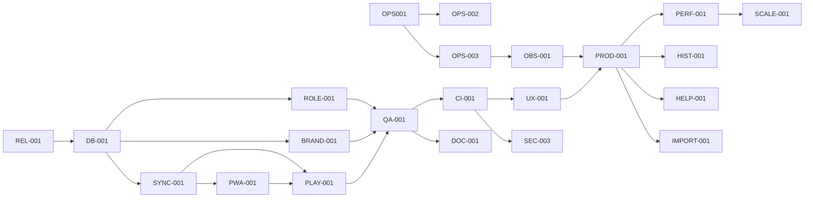

# Plano mestre de implementação — Cifrô

Data-base: 2026-08-10  
Fontes: código atual, `auditoria-prontidao-producao.md`, `reauditoria-2026-08-06.md`, documentação de domínio e alterações locais ainda não consolidadas.

> Correção confirmada pelo responsável em 2026-08-10: os valores citados em `SEC-001` pertencem exclusivamente ao desenvolvimento e não são credenciais de produção. `SEC-001` foi encerrado como falso positivo e não bloqueia beta, backup, monitoramento ou qualquer etapa deste plano.
>
> Decisão operacional confirmada pelo responsável em 2026-08-10: a hospedagem de publicação já fornece backup externo automático. `OPS-001` foi encerrado e descartado como requisito de implementação do repositório.
>
> Decisão operacional confirmada pelo responsável em 2026-08-10: `OPS-002`, incluindo exercício de restauração e definição de RPO/RTO, também foi descartado do escopo do projeto.
>
> Priorização confirmada pelo responsável em 2026-08-10: `OPS-003` permanece no escopo, mas será executado como o último item do plano.
>
> Decisão confirmada pelo responsável em 2026-08-10: `CI-001` foi descartado porque o gate automatizado não será utilizado neste projeto.

## Status de execução — 2026-08-10

| ID | Estado | Evidência |
|---|---|---|
| SEC-001 | encerrado | responsável confirmou dados exclusivamente de desenvolvimento |
| REL-001 | concluído | worktree preservado e baseline registrado |
| DB-001 | implementação principal concluída | runner CLI com ledger/checksum, `--status`, bloqueio explícito de produção e aplicação idempotente no banco de desenvolvimento |
| ROLE-001 | validado | matriz de perfis 44/44 e jornadas críticas 15/15, incluindo externo sem host |
| BRAND-001 | validado | bandas/logo 19/19 e jornadas críticas aprovadas |
| SYNC-001 | validado | sync incremental/concorrência 3/3 e jornadas críticas aprovadas |
| PWA-001 | validado no escopo crítico | fluxo offline real 1/1 e upgrade/jornadas offline 15/15; projeto PWA completo permanece no gate final |
| PLAY-001 | validado | persistência/validade 2/2 e compartilhamento nas jornadas críticas |

Último gate executado: 451 testes PHP/974 asserções com 6 skips condicionais, 16 unitários JavaScript, smoke 6/6, perfis 44/44, bandas 19/19, sync/repertório 5/5, fluxo offline real 1/1 e jornadas críticas 15/15, todos sem falha.

## 1. Diagnóstico consolidado

O Cifrô já possui o núcleo de produto: autenticação, bandas e perfis, cifras, repertórios, roteiros, Live, Ensaio, PWA/offline, planos, Stripe, privacidade, exportação e exclusão de conta. A cobertura medida registrada está acima de 80% de branches em PHP e JavaScript. Em 2026-08-10 foram aprovados localmente 451 testes PHP com 974 asserções e 6 skips condicionais, 16 testes unitários JavaScript e o smoke E2E 6/6.

O produto ainda não deve avançar para lançamento público porque o risco principal deixou de ser falta de funcionalidade e passou a ser liberação controlada:

- os arquivos de ambiente identificados contêm somente dados de desenvolvimento; o risco de credencial produtiva foi descartado pelo responsável;
- existem scripts de backup, restore, health, readiness, monitoramento e runbooks, mas não há evidência de agenda externa, cópia recuperável e restore cronometrado no ambiente real;
- o CI versionado executa auditoria de dependências e segredos, mas não executa build/testes funcionais;
- o worktree contém um lote amplo não consolidado: 67 arquivos rastreados alterados, 1.982 adições, 491 remoções, além de migrations, API incremental, service worker dinâmico, novos testes e recursos de produto ainda não rastreados;
- a regressão completa do lote atual não foi reexecutada nesta auditoria; apenas unitários e smoke foram confirmados;
- schema inicial, scripts `migrate_*` e arquivos em `migrations/` não formam ainda uma trilha única, ordenada, idempotente e auditável;
- rate limit atual usa arquivos em `sys_get_temp_dir()`: cobre múltiplas sessões em uma instância, mas não múltiplas instâncias e depende de IP/proxy corretamente configurado;
- documentação de testes, segurança, API e reauditoria contém estados desatualizados ou contraditórios com o código atual;
- validação real de dispositivos, rede de palco, acessibilidade assistiva e operação durante beta continua necessária.

### Estado atual

Produto funcional e bem coberto localmente, com beta tecnicamente próximo, porém com um grande lote de mudanças em andamento e gates operacionais externos ainda não comprovados.

### Estado desejado

Produto liberável por pequenas mudanças, com segredos fora do workspace, migrations determinísticas, CI verde, backup restaurável, alertas exercitados, documentação coerente, beta mensurável e expansão de funcionalidades orientada por uso real.

## 2. Decisão de priorização

A ordem usa conjuntamente risco, dependências, valor, esforço, impacto, segurança, estabilidade e custo.

1. Preservar e decompor o lote atual antes de novas mudanças evita perda de trabalho e torna rollback possível.
2. `SEC-001` está encerrado; secret scan e arquivos ignorados permanecem como higiene contínua, sem rotação de produção.
3. Migrations e contratos de perfil/sync precedem a validação do lote porque os testes novos dependem do schema correto.
4. Sync incremental precede a atualização PWA porque o pacote offline consome revisão e conteúdo sincronizado.
5. Backup precede restore; restore precede beta.
6. CI, observabilidade e documentação acompanham a estabilização, sem esperar uma fase final.
7. Novas funcionalidades só entram depois do beta produzir evidência de ativação, retenção e falhas.
8. Cache, fila ou horizontalização só entram após teste de carga e métricas demonstrarem necessidade.

## 3. Backlog consolidado

| ID | Item | Origem/evidência | Estado no plano |
|---|---|---|---|
| REL-001 | Consolidar e decompor o lote atual | worktree amplo e regressão completa não revalidada | imediato |
| SEC-001 | Verificar natureza dos dados de ambiente | confirmação do responsável: somente desenvolvimento | encerrado — falso positivo |
| DB-001 | Unificar migrations e validar drift | `create_tables.sql`, `scripts/setup/migrate_*`, `migrations/*` | imediato |
| ROLE-001 | Fechar perfil externo e permissões | migration `usuario_banda_externo`, alterações de bootstrap/UI | imediato |
| BRAND-001 | Fechar criador e identidade da banda | migrations de `criador_id`/logo e telas alteradas | imediato |
| SYNC-001 | Fechar sincronização incremental | `sync_changes`, API `changes.php`, repository e testes 61 | imediato |
| PWA-001 | Fechar atualização/offline atômicos | SW dinâmico, `offline-tools.js`, testes 60/63/produção | imediato |
| PLAY-001 | Fechar persistência e compartilhamento de repertório | `playlist-share.js`, testes 62/63 | imediato |
| QA-001 | Gate completo do lote atual | unit/smoke verdes; full pendente | imediato |
| OPS-001 | Agendar backup externo criptografado | descartado; responsabilidade atendida pela hospedagem | encerrado |
| OPS-002 | Executar restore drill e medir RPO/RTO | P1-02; runbook sem evidência real | bloqueia beta |
| OPS-003 | Ativar monitoramento e alertas | `monitor.php`, `/health`, `/ready`; configuração real pendente | bloqueia beta |
| CI-001 | CI funcional e artefatos | descartado; gate automatizado não será utilizado | encerrado |
| DOC-001 | Reconciliar documentação e rastreabilidade | documentos contradizem código/testes atuais | fundação |
| SEC-002 | Tornar rate limit compartilhável e confiável | armazenamento temporário local | antes de escala pública |
| SEC-003 | Reduzir CSP inline | `unsafe-inline` em scripts e estilos | maturidade de segurança |
| OBS-001 | Métricas, painéis e orçamento de erro | logs existem; consumo/alertas não comprovados | beta/maturidade |
| UX-001 | Validar e fechar UX móvel/acessível | UX-1-01/03 ainda sem validação visual final | quick win |
| PROD-001 | Medir ativação e beta | eventos existem; funil e decisão não comprovados | quick win |
| PERF-001 | Baseline de carga e concorrência | P2-06 aberto | após estabilização |
| HIST-001 | Histórico/versionamento de cifras | P4-03 | nova funcionalidade |
| HELP-001 | Central de ajuda contextual | P4-04 | nova funcionalidade |
| IMPORT-001 | Importação guiada em lote e templates | P4-02 | nova funcionalidade |
| SPIKE-001 | Autorização de importação por URL | provedor depende de autorização formal | investigação externa |
| SCALE-001 | Decidir cache/fila/horizontalização | sem evidência atual de necessidade | posterior |
| OPS-004 | Processo de incidente, auditoria e suporte | runbooks básicos sem exercício recorrente | maturidade |

## 4. Fases de implementação

## Fase 0 — Riscos e bloqueadores

### Objetivo

Transformar o estado local atual em entregas reversíveis e eliminar os bloqueadores de segurança, dados e recuperação.

### Motivo

Não é seguro empilhar novas funcionalidades sobre um lote grande sem baseline, schema determinístico e recuperação comprovada.

### Pré-requisitos

- acesso ao repositório e banco E2E;
- responsável humano com acesso aos provedores de banco, SMTP, Google, Stripe, hospedagem e cofre;
- destino externo para backups e ambiente isolado para restore.

### Itens

`REL-001`, `DB-001`, `ROLE-001`, `BRAND-001`, `SYNC-001`, `PWA-001`, `PLAY-001`, `QA-001`, `OPS-001`, `OPS-002`, `OPS-003`. `SEC-001` está encerrado.

### Resultado esperado

Lote atual dividido em unidades funcionais, schema reproduzível, testes completos verdes e recuperação/alertas comprovados.

### Critério de conclusão

- nenhum segredo ativo no workspace, histórico ou artefatos;
- banco vazio e banco existente convergem ao mesmo schema;
- regressão principal, PWA, visual, cobertura e jornadas críticas aprovadas;
- backup automático externo válido;
- restore isolado concluído em até 4 horas com perda máxima de 24 horas;
- alertas de readiness e backup antigo recebidos e encerrados.

### Riscos

Perder mudanças locais, aplicar migration fora de ordem, invalidar cache PWA, quebrar compatibilidade offline ou revogar segredo antes de configurar o substituto.

### Estratégia de validação

Checkpoint recuperável, diff por item, banco E2E recriado, upgrade de banco existente, full E2E, teste de produção controlado, restore drill e exercício de alertas.

## Fase 1 — Fundação

### Objetivo

Automatizar os gates que impedem regressões e tornar código, documentação e operação observáveis.

### Motivo

Depois de estabilizar o lote atual, o próximo risco é repetir liberações manuais sem sinal reproduzível.

### Pré-requisitos

Fase 0 concluída e comandos locais determinísticos.

### Itens

`CI-001`, `DOC-001`, `OBS-001`, `SEC-002`.

### Resultado esperado

Cada mudança recebe sinal automático de segurança, testes, schema e artefatos; documentação e dashboards refletem o runtime.

### Critério de conclusão

CI verde em três execuções consecutivas, falha proposital detectada, artefatos preservados, documentação sem estados contraditórios e alertas com responsável definido.

### Riscos

CI lento ser ignorado, integração real tornar o pipeline instável ou documentação voltar a divergir.

### Estratégia de validação

Executar matriz por domínio, simular falhas, medir duração e revisar rastreabilidade em cada PR.

## Fase 2 — Quick wins

### Objetivo

Fechar problemas de experiência e obter sinal real do beta com baixo esforço.

### Motivo

As melhorias só devem ocorrer quando o produto já pode ser liberado e observado com segurança.

### Pré-requisitos

Fases 0 e 1; usuários beta consentidos; ambiente de analytics configurado sem dados pessoais indevidos.

### Itens

`UX-001`, `PROD-001`.

### Resultado esperado

Fluxos móvel e acessível confirmados, onboarding mensurado e dúvidas recorrentes convertidas em backlog objetivo.

### Critério de conclusão

Sem UX-1 aberto, tarefas essenciais ≥98%, sessões sem erro ≥99,5% e funil da primeira cifra disponível por coorte beta.

### Riscos

Otimizar por amostra pequena ou coletar telemetria excessiva.

### Estratégia de validação

Testes instrumentais, cinco usuários de perfis distintos, revisão de privacidade dos eventos e acompanhamento por sete dias.

## Fase 3 — Evolução do produto atual

### Objetivo

Melhorar recursos já existentes antes de ampliar o escopo.

### Motivo

Offline, repertório, Live, perfis e administração já concentram o valor e o risco do produto.

### Pré-requisitos

Beta observável e Fase 2 validada.

### Itens

Revisões orientadas por métricas sobre `SYNC-001`, `PWA-001`, `PLAY-001`, `ROLE-001`, `BRAND-001` e `OBS-001`; nenhuma reescrita sem evidência.

### Resultado esperado

Menos trabalho manual, menos falhas no palco e administração coerente por perfil e plano.

### Critério de conclusão

Principais jornadas online/offline sem regressão, suporte recorrente reduzido e métricas dentro dos SLOs.

### Riscos

Criar regras comerciais novas ao corrigir permissões ou aumentar complexidade do sync.

### Estratégia de validação

Canário por banda, contratos retrocompatíveis, teste com duas abas/dois navegadores e rollback por feature flag quando aplicável.

## Fase 4 — Novas funcionalidades

### Objetivo

Adicionar funcionalidades de alto valor apoiadas por evidência do beta.

### Motivo

Histórico, ajuda e importação podem aumentar confiança e ativação, mas não bloqueiam a entrega segura do produto atual.

### Pré-requisitos

Métricas de beta, entrevistas e capacidade operacional estável.

### Itens

`HIST-001`, `HELP-001`, `IMPORT-001`; `SPIKE-001` apenas para decidir a importação por URL.

### Resultado esperado

Colaboração recuperável, menor curva de aprendizado e criação de repertório mais rápida.

### Critério de conclusão

Cada recurso tem adoção mensurável, rollback, documentação, teste e não reduz os SLOs existentes.

### Riscos

Armazenamento crescente no histórico, direitos autorais na importação e conteúdo de ajuda desatualizado.

### Estratégia de validação

Protótipo com beta, limites por plano, rollout gradual e métrica de uso/abandono.

## Fase 5 — Escalabilidade e otimização

### Objetivo

Medir gargalos e otimizar somente o que ultrapassar limites definidos.

### Motivo

Não há evidência atual que justifique fila, cache distribuído ou horizontalização.

### Pré-requisitos

Tráfego real, dashboards e SLOs.

### Itens

`PERF-001`, `SCALE-001` quando os critérios do spike forem atingidos.

### Resultado esperado

Capacidade conhecida, consultas críticas indexadas e decisão explícita sobre arquitetura de escala.

### Critério de conclusão

Resultados reproduzíveis para listas, sync, Live, checkout e concorrência; plano de capacidade aprovado.

### Riscos

Teste irreal, otimização prematura ou cache quebrar isolamento por banda.

### Estratégia de validação

Dados sintéticos sem PII, cenários multiusuário, comparação antes/depois e teste obrigatório de isolamento.

## Fase 6 — Maturidade

### Objetivo

Tornar operação, segurança, suporte e recuperação práticas recorrentes.

### Motivo

Um produto maduro precisa continuar confiável depois do lançamento, não apenas passar no gate inicial.

### Pré-requisitos

Fases anteriores e responsáveis operacionais definidos.

### Itens

`SEC-003`, `OPS-004`, revisão periódica de `OPS-001/002/003`, `CI-001`, `DOC-001` e `OBS-001`.

### Resultado esperado

Incidentes detectados, respondidos e auditados; documentação e recuperação exercitadas; segurança endurecida continuamente.

### Critério de conclusão

Restore trimestral, exercício semestral de incidente, revisão de acesso/segredos, CSP sem `unsafe-inline` para scripts e indicadores de suporte acompanhados.

### Riscos

Processos existirem apenas no papel ou remover inline de forma incompatível com telas legadas.

### Estratégia de validação

Game days, auditoria amostral, testes de headers e revisão pós-incidente com ações rastreadas.

## 5. Implementações detalhadas

## REL-001 — Consolidar e decompor o lote atual

### Objetivo

Criar um baseline recuperável e separar o trabalho atual por contratos de dados, segurança, offline e produto.

### Evidência

`git diff --stat` registra 67 arquivos rastreados alterados, além de novos arquivos em migrations, APIs, testes e produção.

### Estado atual

Unitários e smoke passam, mas o lote mistura mudanças independentes e não possui regressão completa recente.

### Estado desejado

Cada conjunto possui escopo, dependências, testes, documentação e rollback próprios.

### Dependências

Nenhuma; inicia imediatamente.

### Backend

Inventariar contratos alterados de perfil, plano, Live, sync e banda.

### Frontend

Separar navegação/landing, leitor de cifras, repertório, atualização PWA e identidade de banda.

### Banco

Mapear cada coluna/tabela nova para `DB-001`.

### Infraestrutura

Preservar snapshot do diff e saídas de teste sem incluir segredos.

### Segurança

Revisar autorização e isolamento em cada fatia.

### Testes necessários

Unitários e smoke como baseline; suites de domínio por fatia; full no fechamento.

### Documentação

Criar matriz lote → ID → arquivos → testes.

### Migração

Não aplicar migration nesta etapa.

### Rollback

Reverter somente a fatia defeituosa; preservar demais mudanças.

### Critérios de aceite

- nenhum arquivo alterado fica sem item dono;
- cada item tem teste e estratégia de reversão;
- baseline local reproduz 445 PHP, 16 JS e smoke 6/6 ou registra justificativa explícita para diferença.

### Classificação

Complexidade M · Impacto Muito Alto · Risco Alto · Prioridade P0.

## SEC-001 — Verificar natureza dos dados de ambiente — encerrado

### Objetivo

Confirmar se os valores observados pertenciam a produção.

### Evidência

O responsável confirmou em 2026-08-10 que os valores são exclusivamente de desenvolvimento.

### Estado atual

Falso positivo encerrado; arquivos `*.env` permanecem ignorados e gitleaks continua no CI.

### Estado desejado

Nenhuma rotação produtiva é necessária para este item.

### Dependências

Nenhuma.

### Backend

Nenhuma regra de negócio; validar leitura exclusiva por `env()`.

### Frontend

Nenhuma.

### Banco

Rotacionar usuário/senha com privilégio mínimo.

### Infraestrutura

Manter secret scan e não versionar arquivos de ambiente.

### Segurança

Não tratar dados de desenvolvimento como incidente produtivo sem evidência.

### Testes necessários

Gitleaks e verificação de que arquivos de ambiente continuam ignorados.

### Documentação

Registrar a correção da premissa na auditoria e no plano.

### Migração

Não aplicável.

### Rollback

Não aplicável.

### Critérios de aceite

Premissa corrigida e item removido dos gates de liberação.

### Classificação

Complexidade XS · Impacto Baixo · Risco Baixo · Prioridade encerrada.

## DB-001 — Unificar migrations e validar drift

### Objetivo

Garantir instalação limpa e upgrade repetível sem divergência de schema.

### Evidência

Há `create_tables.sql`, scripts `migrate_*` e migrations SQL novas sem catálogo/runner único.

### Estado atual

`setup_db.php` chama parte dos scripts; migrations recentes de `externo`, `criador_id`, logo e `sync_changes` estão distribuídas.

### Estado desejado

Runner ordenado registra versão/checksum e aplica exatamente uma vez; schema limpo e atualizado convergem.

### Dependências

`REL-001`.

### Backend

Criar comando CLI de status/apply com falha fechada.

### Frontend

Nenhuma.

### Banco

Catalogar todas as alterações; adicionar tabela de histórico; tornar migrations idempotentes; definir índices/FKs; validar MySQL alvo.

### Infraestrutura

Executar backup antes de migration e impedir execução via HTTP.

### Segurança

Usuário de migration separado do usuário runtime quando a hospedagem permitir.

### Testes necessários

Banco vazio, upgrade do schema anterior, segunda execução sem efeito, migration interrompida, FK/índices e integração repository.

### Documentação

Atualizar `modelo-de-dados.md`, `HOSTINGER_SETUP.md` e runbook de deploy/rollback.

### Migração

Adicionar somente mudanças forward-compatible; remoções em ciclo posterior.

### Rollback

Migration compensatória testada e restore apenas em ambiente isolado.

### Critérios de aceite

Schema equivalente nos dois caminhos, checksum auditável, zero migration implícita esquecida e teste CI verde.

### Classificação

Complexidade L · Impacto Muito Alto · Risco Alto · Prioridade P0.

## ROLE-001 — Fechar perfil externo e permissões

### Objetivo

Introduzir o convidado externo sem ampliar permissões de conteúdo ou administração.

### Evidência

Migration `20260810_usuario_banda_externo.sql`, `UserFormValidator`, bootstrap, menus e jornadas críticas foram alterados.

### Estado atual

O papel existe no worktree, mas a matriz documental e todos os endpoints ainda precisam de reauditoria conjunta.

### Estado desejado

Externo consulta/acompanha apenas o permitido; básico, gestor, administrador e master mantêm regras atuais.

### Dependências

`DB-001`.

### Backend

Centralizar capacidades `can_*`; testar APIs legadas e atuais; evitar que ordem numérica conceda direitos acidentalmente.

### Frontend

Menus e mensagens coerentes; ocultação nunca substitui autorização.

### Banco

Ampliar enum de forma compatível e validar valores existentes.

### Infraestrutura

Nenhuma.

### Segurança

Testar acesso cruzado, host Live, criação/edição e administração com sessão real por papel.

### Testes necessários

Unitários de validator/helpers, integração por endpoint, E2E por perfil e regressão multi-tenant.

### Documentação

Atualizar visão do produto, funcionalidades, segurança, API e domínios de bandas/Live.

### Migração

Retrocompatível; rollback converte/remover externos antes de reduzir enum.

### Rollback

Feature flag ou desabilitação da atribuição; preservar usuários como básico somente após decisão explícita.

### Critérios de aceite

Matriz completa verde e nenhum externo cria, edita, administra ou hospeda Live.

### Classificação

Complexidade M · Impacto Alto · Risco Alto · Prioridade P1.

## BRAND-001 — Fechar criador e identidade da banda

### Objetivo

Tornar propriedade administrativa e logo consistentes sem quebrar criação, seleção ou planos.

### Evidência

Migrations de `criador_id`/logo, `BandaRepository`, cadastro Google/manual e telas de banda estão alterados.

### Estado atual

Novas regras coexistem com dados anteriores que podem não ter criador/logo.

### Estado desejado

Bandas novas registram criador; antigas possuem fallback/migração; logo tem formato, tamanho e origem seguros.

### Dependências

`DB-001`, `ROLE-001` para regras administrativas finais.

### Backend

Validar criador, propriedade e upload/URL; usar um único helper de logo.

### Frontend

Estados vazio, preview, erro e fallback acessível.

### Banco

Colunas nullable na primeira etapa, backfill determinístico e FK após validação.

### Infraestrutura

Definir armazenamento e retenção se houver upload; não persistir binário grande sem limite.

### Segurança

Bloquear SVG/HTML ativo, SSRF e data URI não permitida; autorizar alteração somente ao papel correto.

### Testes necessários

Cadastro manual/Google, banda legada, limites de logo, XSS/SSRF, troca de banda e mobile.

### Documentação

Atualizar modelo de dados e domínio de bandas.

### Migração

Two-step: adicionar/backfill e só depois restringir.

### Rollback

Manter colunas ignoradas e restaurar fallback padrão.

### Critérios de aceite

Todas as bandas renderizam, novas bandas têm criador e entradas maliciosas são rejeitadas.

### Classificação

Complexidade M · Impacto Médio · Risco Médio · Prioridade P1.

## SYNC-001 — Fechar sincronização incremental

### Objetivo

Reduzir transferência e preservar consistência offline sem perder alterações concorrentes.

### Evidência

Nova tabela `sync_changes`, endpoint `/api/sync/changes.php`, alterações no repository/JS e testes `61-incremental-song-sync.spec.js`.

### Estado atual

Snapshot completo é estável; delta está em implementação e precisa de retenção/fallback definidos.

### Estado desejado

Cliente aplica delta somente sobre revisão conhecida e cai para snapshot completo quando histórico estiver incompleto.

### Dependências

`DB-001`; contratos de banda validados.

### Backend

Registrar upsert/delete/replace na mesma transação da mudança; validar banda pela sessão; limitar janela e payload.

### Frontend

Aplicar delta atomicamente, reconstruir snapshot, preservar versão anterior e informar conflito 409.

### Banco

Índice `(banda_id, revision)`, retenção segura e limpeza por banda.

### Infraestrutura

Métrica de full sync versus delta e bytes transferidos.

### Segurança

Nenhum `banda_id` do cliente autoriza dados; resposta nunca mistura tenants.

### Testes necessários

Criação, edição, exclusão, replace de coleção, duas abas, dois navegadores, lacuna de revisão, retenção expirada, offline e tenant isolation.

### Documentação

Atualizar API, offline/PWA, modelo de dados e rastreabilidade.

### Migração

API aditiva; cliente antigo continua usando snapshot completo.

### Rollback

Desativar endpoint/delta por flag e manter `/api/sync/data.php`.

### Critérios de aceite

Nenhuma perda/sobrescrita, fallback automático aprovado e redução mensurável de payload em mudança unitária.

### Classificação

Complexidade L · Impacto Muito Alto · Risco Alto · Prioridade P1.

## PWA-001 — Fechar atualização e offline atômicos

### Objetivo

Garantir que atualização do app e preparação offline nunca apaguem a última versão funcional.

### Evidência

Service worker dinâmico, progresso de preparo, versão do app e testes reais offline/produção estão no worktree.

### Estado atual

O mecanismo anterior funciona, mas o lote altera cache, atualização, escopo e marcação de shell preparado.

### Estado desejado

Novo pacote só substitui o anterior após assets, páginas e dados válidos; usuário recebe progresso e pode continuar com a versão anterior após falha.

### Dependências

`SYNC-001`.

### Backend

Servir SW com escopo/base path corretos e headers sem cache inadequado.

### Frontend

Progresso acessível, atualização coordenada, fallback online com servidor indisponível e navegação de repertório offline.

### Banco

Nenhuma migration servidor; IndexedDB deve ter upgrade idempotente.

### Infraestrutura

Testar subdiretório real `/beta/public/`, HTTPS e service worker ativo.

### Segurança

Caches contextualizados por usuário/banda e limpeza no logout sem apagar dados de outra sessão incorretamente.

### Testes necessários

Instalação limpa, upgrade de versão antiga, falha no meio, F5 offline, servidor indisponível, troca de banda, sessão expirada e produção controlada.

### Documentação

Atualizar arquitetura, domínio offline, testes e runbook de release PWA.

### Migração

Versionar cache e IndexedDB; compatibilidade com SW anterior durante um ciclo.

### Rollback

Reimplantar SW anterior com versão superior/kill switch; nunca depender de reduzir número de cache.

### Critérios de aceite

Teste 60, 63, projeto PWA e smoke de produção passam; pacote anterior permanece utilizável em toda falha simulada.

### Classificação

Complexidade L · Impacto Muito Alto · Risco Alto · Prioridade P1.

## PLAY-001 — Fechar persistência e compartilhamento de repertório

### Objetivo

Garantir que repertório salvo, validade, navegação e compartilhamento persistam online/offline.

### Evidência

`playlist-share.js` e testes `62-playlist-persistence.spec.js`/`63-critical-real-user-journeys.spec.js`.

### Estado atual

Gestão de playlists existe; o lote adiciona persistência real, share e navegação por teclado/swipe.

### Estado desejado

Repertório salvo reaparece após F5, respeita validade e abre músicas na ordem em qualquer conexão suportada.

### Dependências

`SYNC-001`, `PWA-001`.

### Backend

Persistir ordem/validade atomicamente e registrar revisão.

### Frontend

Compartilhamento nativo com fallback desktop; teclado/swipe sem conflitar com edição/acessibilidade.

### Banco

Sem mudança além das já cobertas pelo sync, salvo contrato comprovado.

### Infraestrutura

Nenhuma.

### Segurança

Compartilhar apenas texto/URL autorizado; não expor tokens ou IDs internos desnecessários.

### Testes necessários

Salvar/F5, validade, offline, ordem, mobile/desktop share, teclado, swipe, papel sem edição e XSS no título.

### Documentação

Atualizar domínio de setlists/roteiros, funcionalidades e testes.

### Migração

Contrato aditivo e leitura de registros antigos.

### Rollback

Desabilitar share/navegação nova sem afetar persistência existente.

### Critérios de aceite

Testes 62/63 verdes e repertório criado pela UI funciona após F5 offline.

### Classificação

Complexidade M · Impacto Alto · Risco Médio · Prioridade P1.

## QA-001 — Gate completo do lote atual

### Objetivo

Provar que todas as fatias integradas funcionam e não regridem o produto existente.

### Evidência

Unitários e smoke atuais passam; full, visual, PWA, cobertura e produção não foram reexecutados em conjunto.

### Estado atual

Sinal parcial verde.

### Estado desejado

Sinal completo reproduzível, skips justificados e artefatos de falha disponíveis.

### Dependências

`DB-001`, `ROLE-001`, `BRAND-001`, `SYNC-001`, `PWA-001`, `PLAY-001`.

### Backend/Frontend/Banco/Infraestrutura

Não introduzir comportamento; corrigir apenas defeitos comprovados, um por alteração testável; recriar banco E2E antes da execução canônica.

### Segurança

Executar auditoria de dependências, gitleaks e isolamento por banda.

### Testes necessários

Unit, integration, E2E principal, PWA, visual, quality, coverage, jornadas 59–63 e smoke de produção controlado.

### Documentação

Registrar comandos, duração, resultado, skips e artefatos em evidência datada.

### Migração

Validar clean install e upgrade.

### Rollback

Remover a fatia responsável e repetir o gate; não ampliar timeout como correção.

### Critérios de aceite

Zero falhas, zero testes pendurados, skips com condição externa explícita e orçamento de duração cumprido.

### Classificação

Complexidade L · Impacto Muito Alto · Risco Alto · Prioridade P0.

## OPS-001 — Agendar backup externo criptografado — encerrado

Status: descartado como requisito do repositório. O ambiente onde a aplicação será publicado já fornece backup externo automático.

### Objetivo

Converter o script existente em proteção operacional real.

### Evidência

`backup_database.php` permanece disponível para uso manual, mas sua agenda não faz parte do escopo da aplicação.

### Estado atual

Implementação e teste do serviço existem.

### Estado desejado

Backup diário externo, criptografado, verificado e monitorado por 30 dias.

### Dependências

Armazenamento externo e credenciais próprias do ambiente de execução.

### Backend/Frontend/Banco

Sem mudança funcional; usar dump consistente com usuário de leitura apropriado.

### Infraestrutura

Scheduler, diretório externo, chave no cofre, retenção e alerta de backup >25 horas.

### Segurança

Permissões mínimas, chave separada e proibição de destino dentro do projeto.

### Testes necessários

Execução real, arquivo não vazio, decrypt em ambiente isolado, retenção e falha de destino.

### Documentação

Atualizar runbook com agenda, responsável e evidência.

### Migração

Nenhuma.

### Rollback

Desabilitar nova agenda sem apagar backups existentes; voltar ao scheduler anterior se houver.

### Critérios de aceite

Dois ciclos automáticos consecutivos, alerta de ausência funcionando e nenhum segredo no log.

### Classificação

Complexidade S · Impacto Muito Alto · Risco Alto · Prioridade P0.

## OPS-002 — Executar restore drill

### Objetivo

Provar recuperação dentro de RPO 24h/RTO 4h.

### Evidência

`restore_database.php` restringe banco `_restore_`, mas falta evidência real.

### Estado atual

Runbook e script disponíveis.

### Estado desejado

Banco isolado restaurado, validado e descartado por procedimento seguro.

### Dependências

`OPS-001`, `DB-001`.

### Backend/Frontend

Apontar instância isolada e validar jornadas críticas.

### Banco

Conferir contagens, FKs, revisões, usuários, bandas, músicas, repertórios e aceites.

### Infraestrutura

Cronometrar download, decrypt, restore, validação e retorno.

### Segurança

Dados restaurados recebem mesmo controle e são removidos com alvo explicitamente validado após evidência.

### Testes necessários

Login, leitura por banda, sync, edição, Live e integridade referencial.

### Documentação

Anexar relatório sem PII e atualizar RPO/RTO se necessário.

### Migração

Aplicar apenas migrations posteriores ao backup pelo runner oficial.

### Rollback

Abandonar ambiente isolado; nunca restaurar sobre produção durante o drill.

### Critérios de aceite

RPO/RTO atendidos e checklist assinado por Engenharia/Operações.

### Classificação

Complexidade M · Impacto Muito Alto · Risco Alto · Prioridade P0.

## OPS-003 — Ativar monitoramento e alertas

### Objetivo

Detectar indisponibilidade do app/banco e backup antigo antes do usuário.

### Evidência

`health.php`, `ready.php` e `monitor.php` existem; webhook/agendamento real não comprovados.

### Estado atual

Checks locais sem evidência de operação contínua.

### Estado desejado

Monitor externo, alerta entregue e processo de reconhecimento/escalonamento.

### Dependências

`OPS-001`.

### Backend

Manter `/health` independente e `/ready` dependente do banco.

### Frontend/Banco

Nenhuma mudança.

### Infraestrutura

Agendar checks, configurar webhook, retenção de logs e monitor externo ao mesmo host.

### Segurança

Endpoints não expõem versões, credenciais ou stack trace.

### Testes necessários

Banco indisponível, processo indisponível, backup antigo, webhook falho e recuperação.

### Documentação

Atualizar contatos, severidade, horário e escalonamento.

### Migração

Nenhuma.

### Rollback

Voltar destino do alerta sem desligar health/readiness.

### Critérios de aceite

Alertas simulados recebidos, reconhecidos e encerrados; falsos positivos conhecidos documentados.

### Classificação

Complexidade S · Impacto Alto · Risco Médio · Prioridade P0.

## CI-001 — CI funcional e artefatos — encerrado

Status: descartado por decisão de escopo. O projeto não utilizará automação do gate em CI.

### Objetivo

Executar automaticamente gates de schema, unidade, integração controlada, E2E particionado e cobertura.

### Evidência

Workflow atual cobre somente dependências e gitleaks.

### Estado atual

Testes dependem de XAMPP/PowerShell local e MySQL compartilhado.

### Estado desejado

Runner Linux/Windows reproduzível com banco isolado, cache seguro e artefatos por domínio.

### Dependências

`DB-001`, `QA-001`.

### Backend/Frontend/Banco

Eliminar caminhos absolutos dos comandos CI; provisionar MySQL; executar suites separadas.

### Infraestrutura

Workflow com jobs security, unit, schema, smoke, PWA/visual e full noturno; proteção de branch.

### Segurança

Secrets somente para jobs controlados; PR externo não acessa credenciais.

### Testes necessários

Falha proposital, retry zero local, artefatos de Playwright e cobertura.

### Documentação

Atualizar `docs/testes.md` e README.

### Migração

Nenhuma.

### Rollback

Gate informativo por curto período; nunca remover security workflow.

### Critérios de aceite

Três execuções verdes, falha detectada e feedback rápido dentro do orçamento acordado.

### Classificação

Complexidade L · Impacto Muito Alto · Risco Médio · Prioridade P1.

## DOC-001 — Reconciliar documentação e rastreabilidade

### Objetivo

Fazer a documentação representar o código liberável.

### Evidência

`seguranca-e-permissoes.md` diz rate limit por sessão; `testes.md` descreve Ensaio desativado e Stripe simulado; reauditoria contém linhas já superadas.

### Estado atual

Boa cobertura documental, mas data/status divergentes.

### Estado desejado

Catálogo, API, dados, segurança, testes, domínios e reauditoria coerentes e datados.

### Dependências

`QA-001`.

### Backend/Frontend/Banco/Infraestrutura

Nenhuma mudança de comportamento.

### Segurança

Não documentar segredo, host privado ou dado pessoal.

### Testes necessários

Checagem de links, inventário de rotas/IDs e revisão contra código.

### Documentação

Atualizar `docs/README.md`, `funcionalidades.md`, `api.md`, `modelo-de-dados.md`, `seguranca-e-permissoes.md`, `testes.md`, `rastreabilidade.md` e domínios afetados.

### Migração/Rollback

Não aplicável; reverter somente afirmação incorreta.

### Critérios de aceite

Nenhuma lacuna conhecida é descrita como implementada e nenhum recurso implementado permanece descrito como desativado.

### Classificação

Complexidade M · Impacto Alto · Risco Baixo · Prioridade P1.

## SEC-002 — Rate limit compartilhável

### Objetivo

Manter proteção contra abuso em múltiplos processos/instâncias e atrás de proxy confiável.

### Evidência

Buckets atuais ficam em arquivo temporário por fingerprint ação+identidade+IP.

### Estado atual

Adequado para uma instância com storage persistente local; insuficiente para horizontalização.

### Estado desejado

Store atômico compartilhado com TTL, política de proxy explícita e observabilidade.

### Dependências

`OBS-001`; decisão de hospedagem.

### Backend

Criar interface de store e adaptadores arquivo/DB/Redis; aplicar backoff e `Retry-After` quando apropriado.

### Frontend

Mensagens neutras e acessíveis.

### Banco/Infraestrutura

Usar DB com índice/expiração ou Redis somente se disponível; limpeza automática.

### Segurança

Não confiar em `X-Forwarded-For` sem lista de proxies; não permitir bypass por identidade vazia.

### Testes necessários

Múltiplas sessões, processos, IPs, janela/TTL, concorrência e usuário legítimo.

### Documentação

Atualizar segurança e operação.

### Migração

Troca por configuração com fallback controlado.

### Rollback

Retornar ao file store em instância única.

### Critérios de aceite

Abuso distribuído bloqueado sem afetar jornada legítima e alertas sem PII.

### Classificação

Complexidade M · Impacto Alto · Risco Médio · Prioridade P1.

## OBS-001 — Métricas e painéis operacionais

### Objetivo

Converter logs estruturados e eventos de produto em sinais acionáveis.

### Evidência

`OperationalLogger` e eventos de ativação/sync/Live/Stripe existem; não há painéis e alertas comprovados.

### Estado atual

Eventos vão a logs; analytics do cliente é configurável.

### Estado desejado

Painéis de disponibilidade, erro, latência, sync, Live, e-mail, Stripe e ativação com limites e responsáveis.

### Dependências

`OPS-003`, política de privacidade.

### Backend/Frontend/Banco/Infraestrutura

Padronizar nomes/campos, coletar logs e eventos, definir retenção e dashboards sem aumentar PII.

### Segurança

IDs somente pseudonimizados; nenhuma cifra, e-mail, token ou IP em claro.

### Testes necessários

Eventos de sucesso/falha, redaction, volume e alerta.

### Documentação

Catálogo de eventos, SLOs e runbook.

### Migração/Rollback

Configuração aditiva; desligar sink externo preservando logs locais.

### Critérios de aceite

Cada incidente do runbook é detectável e cada métrica tem fonte, janela e dono.

### Classificação

Complexidade M · Impacto Alto · Risco Médio · Prioridade P1.

## UX-001 — Fechar UX móvel e acessível

### Objetivo

Resolver evidências residuais de setlists/plano móvel e validar mudanças atuais em dispositivos reais.

### Evidência

UX-1-01 e validação final de UX-1-03 permaneceram abertas na reauditoria.

### Estado atual

Há testes automatizados e correções CSS, sem confirmação assistiva/real atual.

### Estado desejado

Jornadas de cadastro, repertório, cifra, plano e configuração funcionam em 320–430 px, zoom 200%, teclado e leitor de tela.

### Dependências

`QA-001`.

### Backend/Banco/Infraestrutura

Sem alteração esperada.

### Frontend

Corrigir somente problemas reproduzidos: overflow, foco, ordem, alvo 44 px, label, contraste e movimento reduzido.

### Segurança

Não relaxar validação ou autorização para simplificar UX.

### Testes necessários

Playwright visual/quality e checklist manual NVDA/VoiceOver, teclado, zoom e aparelhos.

### Documentação

Registrar matriz de dispositivos e evidência.

### Migração/Rollback

Não aplicável; rollback CSS por componente.

### Critérios de aceite

Sem overflow crítico, toda tarefa concluída sem mouse e nenhuma barreira severa WCAG encontrada.

### Classificação

Complexidade S · Impacto Alto · Risco Baixo · Prioridade P1.

## PROD-001 — Medir ativação e beta

### Objetivo

Validar se usuários chegam à primeira cifra e usam repertório/offline/Live.

### Evidência

Eventos `activation.registration_completed`, `activation.first_song_created` e camada `cifro-analytics.js` existem.

### Estado atual

Instrumentação parcial sem painel/coorte e sem gate de decisão comprovado.

### Estado desejado

Funil landing → cadastro → ativação → primeira cifra → repertório → retorno, sem PII.

### Dependências

`OBS-001`, `UX-001`, revisão de privacidade.

### Backend/Frontend/Infraestrutura

Completar eventos mínimos, sink configurável, painel e amostra beta.

### Banco

Evitar nova tabela se a ferramenta de métricas resolver; se necessária, retenção curta e agregada.

### Segurança

Consentimento e minimização; não enviar conteúdo musical nem identificador em claro.

### Testes necessários

Evento único por transição, ad blocker/offline, falha do sink sem impacto na página.

### Documentação

Catálogo de eventos e política de dados.

### Migração/Rollback

Feature flag; desligar coleta sem afetar produto.

### Critérios de aceite

Funil consultável e decisões do beta registradas após sete dias.

### Classificação

Complexidade S · Impacto Alto · Risco Baixo · Prioridade P1.

## PERF-001 — Baseline de carga e concorrência

### Objetivo

Responder quanta carga o produto atual suporta e onde falha.

### Evidência

P2-06 continua sem resultado de carga/concorrência.

### Estado atual

Testes funcionais cobrem concorrência pontual, não capacidade.

### Estado desejado

Metas e resultados para login, listas, sync, Live, webhook e escrita concorrente.

### Dependências

`OBS-001`, beta estável.

### Backend/Frontend/Banco/Infraestrutura

Criar dados sintéticos, medir p50/p95/p99, erro e recursos; analisar queries e índices somente após resultado.

### Segurança

Ambiente isolado, limites de taxa e nenhum dado real.

### Testes necessários

Carga gradual, pico, soak, duas abas, edição concorrente e isolamento.

### Documentação

Relatório de capacidade e limiares.

### Migração/Rollback

Otimizações têm benchmark antes/depois e rollback individual.

### Critérios de aceite

Capacidade máxima segura conhecida e gargalos priorizados por evidência.

### Classificação

Complexidade M · Impacto Médio · Risco Médio · Prioridade P2.

## HIST-001 — Histórico de cifras

### Objetivo

Permitir recuperar versões e resolver conflitos de edição.

### Evidência

P4-03; conflitos são risco natural do sync incremental.

### Estado atual

Revisão de conteúdo existe, mas não há histórico recuperável por música.

### Estado desejado

Cada edição cria versão com autor pseudonimizado/data; gestor visualiza diff e restaura como nova versão.

### Dependências

`SYNC-001`, `PERF-001`, validação de valor no beta.

### Backend/Frontend/Banco

Tabela append-only, serviço de versões, API paginada e UI de comparação/restauração.

### Infraestrutura

Métrica de crescimento e política de retenção.

### Segurança

Isolamento por banda e conteúdo histórico incluído em exportação/exclusão.

### Testes necessários

Criação, concorrência, diff, restore, permissão, tenant e retenção.

### Documentação

Funcionalidades, API, dados, privacidade e domínio de músicas.

### Migração

Aditiva; não backfillar conteúdo anterior sem necessidade.

### Rollback

Ocultar UI e parar novas versões preservando dados.

### Critérios de aceite

Restauração não sobrescreve silenciosamente e histórico não vaza entre bandas.

### Classificação

Complexidade L · Impacto Alto · Risco Médio · Prioridade P2.

## HELP-001 — Central de ajuda contextual

### Objetivo

Reduzir treinamento para setlist, Live, Ensaio, offline, pitch e loop.

### Evidência

Teste de compreensão da auditoria e P4-04.

### Estado atual

Onboarding e textos existem, mas não há ajuda contextual consolidada.

### Estado desejado

Ajuda curta por tarefa, pesquisável e vinculada à versão do produto.

### Dependências

`PROD-001` e dúvidas reais do beta.

### Backend/Banco

Preferir conteúdo estático versionado inicialmente.

### Frontend

Links contextuais, foco acessível e vídeos opcionais com texto equivalente.

### Infraestrutura

Hospedar mídia otimizada apenas se necessária.

### Segurança

Sem embeds de terceiros sem consentimento/política.

### Testes necessários

Links, teclado, mobile, conteúdo offline quando crítico e analytics sem PII.

### Documentação

A própria central é documentação; manter dono/data.

### Migração/Rollback

Não aplicável; links podem ser removidos isoladamente.

### Critérios de aceite

Usuário beta conclui as tarefas alvo sem suporte humano e dúvidas recorrentes diminuem.

### Classificação

Complexidade M · Impacto Médio · Risco Baixo · Prioridade P2.

## IMPORT-001 — Importação guiada em lote e templates

### Objetivo

Reduzir tempo até repertório útil sem depender de scraping.

### Evidência

P4-02 e importação por conteúdo colado já implementada.

### Estado atual

Importação individual existe; URL externa depende de autorização.

### Estado desejado

Usuário importa múltiplas cifras autorizadas, revisa preview e usa templates de repertório.

### Dependências

`PROD-001`; pesquisa com beta.

### Backend/Frontend/Banco

Parser em lote com limites, preview/erros por item, confirmação e gravação transacional parcial explícita.

### Infraestrutura

Processamento assíncrono somente se volume medido exigir.

### Segurança

Sanitização, limite de tamanho, rate limit, declaração de direitos e nenhuma busca externa implícita.

### Testes necessários

Formato simples/complexo, encoding, payload malicioso, duplicado, falha parcial e plano.

### Documentação

Guia de formatos e direitos.

### Migração

Preferir contrato existente; versionar API se quebrar payload.

### Rollback

Desativar importação em lote preservando importação individual.

### Critérios de aceite

Preview obrigatório, nenhum script persistido e redução comprovada do tempo de ativação.

### Classificação

Complexidade L · Impacto Alto · Risco Médio · Prioridade P2.

## SPIKE-001 — Investigar autorização de importação por URL

### Pergunta que precisa ser respondida

Existe API, licença ou autorização formal que permita importar conteúdo do provedor com atribuição e limites definidos?

### Arquivos/fluxos a investigar

`ChordImportProvider`, `ChordImportProviderResolver`, `CifraClubImportProvider`, termos do provedor e desenho de importação.

### Resultado esperado

Decisão escrita: ativar com contrato aprovado, manter desativado ou remover.

### Decisão que dependerá da investigação

Qualquer chamada externa automática por URL. Sem autorização, o item permanece fora da implementação.

### Classificação

Complexidade S · Impacto Médio · Risco Alto · Prioridade P2.

## SCALE-001 — Decidir arquitetura de escala

### Objetivo

Decidir se cache, filas ou múltiplas instâncias são necessários.

### Evidência

Não há justificativa real atual; depende de `PERF-001` e tráfego.

### Critério de entrada

SLO violado de forma repetida, saturação mensurável ou operação externa bloqueando requisições.

### Resultado esperado

ADR com alternativa, custo, risco, migração, teste e rollback; pode concluir “não implementar”.

### Classificação

Complexidade S para spike, implementação a estimar · Impacto variável · Risco Médio · Prioridade P3.

## SEC-003 — CSP sem script inline inseguro

### Objetivo

Remover `unsafe-inline` de `script-src` por nonces/hashes e reduzir exposição XSS.

### Evidência

CSP atual permite inline e integra Google Analytics.

### Dependências

`CI-001`, inventário completo de scripts inline.

### Implementação

Extrair scripts para módulos ou aplicar nonce por resposta; testar páginas públicas/autenticadas, Google, Stripe e PWA; estilos inline ficam em etapa separada.

### Rollback

Report-only e rollout gradual antes de enforcement.

### Critérios de aceite

Zero violação legítima, testes de headers verdes e `script-src` sem `unsafe-inline`.

### Classificação

Complexidade L · Impacto Alto · Risco Médio · Prioridade P2.

## OPS-004 — Incidente, auditoria e suporte recorrentes

### Objetivo

Transformar runbooks em capacidade operacional contínua.

### Implementação

Definir severidades/donos, linha do tempo, comunicação, post-mortem sem culpa, revisão de acessos, restore trimestral, game day semestral e triagem de suporte ligada ao backlog.

### Testes necessários

Exercício de DB indisponível, Stripe, SMTP, sync e segurança.

### Critérios de aceite

Exercício concluído no prazo, ações rastreadas e nenhuma dependência sem responsável.

### Classificação

Complexidade M · Impacto Alto · Risco Baixo · Prioridade P2.

## 6. Dependências

### Pode começar imediatamente

`REL-001` e o desenho de `OPS-001` podem começar imediatamente. A preparação de `DB-001` começa após o inventário inicial de `REL-001`.

### Bloqueados

- `PWA-001` por `SYNC-001`;
- `PLAY-001` por sync/PWA;
- `QA-001` pelas fatias funcionais;
- `OPS-002` por backup real;
- beta por `QA-001`, `OPS-002` e `OPS-003`;
- novas funcionalidades por evidência do beta.

## 7. Trabalhos paralelizáveis

### Trilha A — Segurança e operação

`OBS-001` → `SEC-002`/`SEC-003` → demais itens pendentes → `OPS-003`. `OPS-001` e `OPS-002` estão encerrados por decisão de escopo; `OPS-003` é o último item.

### Trilha B — Dados e sync

`REL-001` → `DB-001` → `SYNC-001` → `PWA-001`.

### Trilha C — Produto existente

Após `DB-001`: `ROLE-001` e `BRAND-001` podem ocorrer em paralelo; `PLAY-001` começa após contratos de sync/PWA estabilizarem.

### Trilha D — Qualidade e documentação

Baseline acompanha cada item; `QA-001` integra as trilhas. `DOC-001` pode ser redigido por domínio durante as mudanças e fechado após o gate.

### Trilha E — Produto e UX

Após `QA-001`: `UX-001` e instrumentação de `PROD-001` podem avançar em paralelo, com revisão comum de privacidade.

As trilhas não devem editar simultaneamente `bootstrap.php`, `cifro-sync.js`, `service-worker*`, `create_tables.sql` ou `docs/api.md` sem coordenação explícita.

## 8. Ordem completa de implementação

1. `REL-001` — preservar, inventariar e decompor o lote atual.
2. `DB-001` — estabelecer schema/migrations antes de validar recursos que dependem deles.
3. `SEC-001` — encerrado como falso positivo; nenhuma implementação.
4. `ROLE-001` — fechar a matriz de permissões antes das jornadas integradas.
5. `BRAND-001` — fechar criador/logo sobre o schema estável.
6. `SYNC-001` — estabilizar delta e fallback.
7. `PWA-001` — consumir revisão/snapshot estáveis e validar atualização atômica.
8. `PLAY-001` — fechar repertório sobre sync/offline estáveis.
9. `QA-001` — executar o gate integrado do lote.
10. `OPS-001` — ativar backup real.
11. `OPS-002` — descartado por decisão de escopo.
12. `OPS-003` — ativar e exercitar checks/alertas.
13. `CI-001` — descartado por decisão de escopo.
14. `DOC-001` — consolidar documentação após contratos estáveis.
15. `OBS-001` — ligar eventos a métricas e SLOs.
16. `SEC-002` — preparar proteção de abuso para topologia real.
17. `UX-001` — fechar validação móvel/acessível.
18. `PROD-001` — executar beta e medir ativação.
19. `PERF-001` — medir carga sobre produto estável.
20. `HIST-001` — implementar se conflitos/recuperação tiverem valor comprovado.
21. `HELP-001` — priorizar conteúdos pelas dúvidas do beta.
22. `IMPORT-001` — ampliar importação pelo impacto na ativação.
23. `SPIKE-001` — decidir importação por URL sem implementar sem autorização.
24. `SEC-003` — endurecer CSP com rollout controlado.
25. `SCALE-001` — executar somente se métricas ultrapassarem limiares.
26. `OPS-004` — institucionalizar exercícios e suporte contínuos.

Mudanças de ordem relevantes: operações externas avançam em paralelo, mas restore precisa de backup real; PWA vem depois do sync porque compartilha revisão; CI vem depois do gate local comprovado para não automatizar uma sequência instável; novas funcionalidades vêm depois do beta para evitar decisões sem uso real.

## 9. Plano em ondas

### Onda 1 — Estabilizar

`REL-001` a `OPS-003`. Saída: base segura, recuperável e testada.

### Onda 2 — Melhorar

`CI-001`, `DOC-001`, `OBS-001`, `SEC-002`, `UX-001`, `PROD-001`. Saída: beta observável e melhoria contínua.

### Onda 3 — Expandir

`HIST-001`, `HELP-001`, `IMPORT-001`, condicionado ao beta. Saída: colaboração, aprendizado e ativação melhores.

### Onda 4 — Escalar

`PERF-001`, `SCALE-001`. Saída: capacidade conhecida e arquitetura baseada em evidência.

### Onda 5 — Diferenciar

Evoluções de Live/offline/repertório escolhidas pelas métricas, mais `SEC-003` e `OPS-004` como garantia de qualidade. Saída: produto confiável no palco e sustentável na operação.

## 10. Marcos

### Marco 1 — Base segura

- lote atual decomposto e full gate verde;
- risco de credencial produtiva descartado e secret scan preservado;
- migrations determinísticas;
- backup, restore e alertas comprovados.

### Marco 2 — Produto consistente

- CI funcional;
- documentação coerente;
- UX móvel/acessível validada;
- beta com SLOs e funil de ativação.

### Marco 3 — Produto evoluído

- melhorias de sync/offline/repertório validadas em uso real;
- histórico, ajuda e importação entregues apenas quando aprovados por valor/esforço/risco.

### Marco 4 — Produto maduro

- capacidade conhecida;
- segurança endurecida;
- restore e incidentes exercitados periodicamente;
- suporte, métricas, documentação e operação sustentáveis.

## 11. Definition of Done

Um item só termina quando, conforme aplicável:

- comportamento e critérios de aceite implementados;
- build/comandos executam em ambiente limpo;
- unitários, integração, E2E e regressão proporcionais passam;
- autorização, tenant isolation, CSRF, XSS e dados sensíveis foram revisados;
- migration foi testada em banco vazio, upgrade e segunda execução;
- logs e erros são acionáveis sem PII/segredos;
- documentação, API, dados, testes e rastreabilidade foram atualizados;
- artefatos/evidência foram preservados;
- rollout e rollback foram exercitados ou simulados;
- sistema permanece compilável, executável, testável e implantável.

## 12. Plano executável por agente — primeiras etapas

## Etapa 01 — REL-001: baseline e decomposição

Objetivo: preservar o lote atual e atribuir cada arquivo a uma entrega coerente.

Arquivos envolvidos: todo `git status`, com foco em `create_tables.sql`, `migrations/`, `public/api/sync/`, `public/service-worker*`, `public/src/backend/bootstrap.php`, views/JS alterados e testes 59–63.

Dependências: nenhuma.

Passos:

1. Registrar status, diff stat e lista de não rastreados sem exibir `.env`.
2. Criar matriz arquivo → `DB/ROLE/BRAND/SYNC/PWA/PLAY/UX`.
3. Identificar arquivos compartilhados e ordem de integração.
4. Reexecutar unitários e smoke; guardar saídas.

Testes: `npm run test:unit`; `npm run test:e2e:smoke`.

Critérios de aceite: todo arquivo possui dono; baseline reproduz resultados atuais; nenhum arquivo do usuário é descartado.

Documentação a atualizar: este plano e evidência datada do lote.

Não fazer: reset, restore destrutivo, reformatar o lote inteiro ou misturar segredos na evidência.

Próxima etapa: `DB-001` no código; `OPS-001` pode avançar em paralelo.

## Etapa 02 — SEC-001: encerrada

Objetivo: registrar que os dados são exclusivamente de desenvolvimento.

Arquivos envolvidos: documentação de auditoria e plano.

Dependências: confirmação do responsável, já recebida.

Passos:

1. Registrar a correção da premissa.
2. Manter arquivos de ambiente ignorados.
3. Manter gitleaks no CI.
4. Remover o item dos gates operacionais.

Testes: `git check-ignore` e gitleaks no CI.

Critérios de aceite: item não bloqueia liberação e nenhum dado de ambiente é versionado.

Documentação a atualizar: auditoria e plano mestre.

Não fazer: executar rotação produtiva sem existir credencial produtiva envolvida.

Próxima etapa: `DB-001`; `OPS-001` pode seguir em paralelo.

## Etapa 03 — DB-001: runner e migrations

Objetivo: fazer instalação e upgrade convergirem.

Arquivos envolvidos: `create_tables.sql`, `scripts/setup/setup_db.php`, `scripts/setup/migrate_*.php`, `migrations/*.sql`, modelo de dados e testes PHP.

Dependências: `REL-001`.

Passos:

1. Ordenar migrations existentes e definir versão/checksum.
2. Criar comando CLI status/apply, inacessível via HTTP.
3. Integrar migrations de criador, logo, externo e sync changes.
4. Comparar schema de banco limpo e atualizado.

Testes: clean install, upgrade, reexecução, falha intermediária e integração repository.

Critérios de aceite: schemas equivalentes; nenhuma migration reaplica; rollback compensatório documentado.

Documentação a atualizar: modelo de dados, setup e runbook de deploy.

Não fazer: remover coluna no mesmo ciclo em que deixa de ser usada.

Próxima etapa: `ROLE-001` e `BRAND-001` em paralelo.

## Etapa 04 — ROLE-001: perfil externo

Objetivo: fechar contrato e autorização do novo papel.

Arquivos envolvidos: migration de externo, `UserFormValidator.php`, `bootstrap.php`, endpoints Live/usuários/bandas, topnav/views e testes 23/63.

Dependências: `DB-001`.

Passos:

1. Enumerar capacidades por papel.
2. Centralizar autorização backend e revisar endpoints legados.
3. Ajustar menus/mensagens.
4. Executar matriz E2E e tenant isolation.

Testes: validator/helpers, APIs por papel, Live host/follower, administração e dois tenants.

Critérios de aceite: externo só acessa o explicitamente permitido; nenhuma regressão nos demais papéis.

Documentação a atualizar: visão, segurança, API, bandas e Live.

Não fazer: confiar na ocultação do menu.

Próxima etapa: integrar no `QA-001`.

## Etapa 05 — BRAND-001: criador e logo

Objetivo: fechar identidade e propriedade administrativa de banda.

Arquivos envolvidos: migrations de criador/logo, `BandaRepository.php`, cadastro manual/Google, telas de banda/seleção/topnav e testes 07.

Dependências: `DB-001`, contrato administrativo de `ROLE-001`.

Passos:

1. Definir backfill/fallback de bandas antigas.
2. Garantir criador em todos os fluxos de criação.
3. Validar formato/tamanho/origem do logo.
4. Testar renderização, troca e autorização.

Testes: cadastro manual/Google, legado, XSS/SSRF, limites e mobile.

Critérios de aceite: nenhuma banda quebra sem logo/criador; alteração não autorizada falha.

Documentação a atualizar: bandas e modelo de dados.

Não fazer: aceitar SVG/HTML ativo ou data URI irrestrita.

Próxima etapa: integrar no `QA-001`.

## Etapa 06 — SYNC-001: delta incremental

Objetivo: aplicar mudanças pequenas sem perder consistência.

Arquivos envolvidos: `sync_changes` migration, `SyncRevisionRepository.php`, endpoints de sync, endpoints que alteram conteúdo, `cifro-sync.js` e teste 61.

Dependências: `DB-001`.

Passos:

1. Registrar mudança e revisão na mesma transação.
2. Implementar resposta delta por sessão/banda.
3. Aplicar delta atomicamente e manter snapshot anterior.
4. Definir retenção e fallback full sync.

Testes: criar/editar/excluir, replace, duas abas/navegadores, lacuna, tenant, offline e conflito.

Critérios de aceite: zero perda, fallback comprovado e payload menor em mudança unitária.

Documentação a atualizar: API, offline, dados e rastreabilidade.

Não fazer: autorizar por `banda_id` recebido do cliente.

Próxima etapa: `PWA-001`.

## Etapa 07 — PWA-001: atualização atômica

Objetivo: atualizar app/dados mantendo a última versão funcional.

Arquivos envolvidos: `public/service-worker.js`, `service-worker.php`, `cifro-sync.js`, `offline-tools.js`, manifest, router e testes 30/60/63/produção.

Dependências: `SYNC-001`.

Passos:

1. Versionar cache e contexto base path.
2. Preparar assets/páginas em cache temporário.
3. Promover somente após validação e marcar revisão/versão.
4. Validar falha, upgrade e produção em subdiretório.

Testes: projeto PWA, F5 offline, servidor indisponível, upgrade antigo, falha intermediária e smoke produção.

Critérios de aceite: cache anterior permanece em falha; escopo real correto; progresso acessível.

Documentação a atualizar: arquitetura, offline, testes e release PWA.

Não fazer: limpar caches/dados antes do pacote novo estar válido.

Próxima etapa: `PLAY-001`.

## Etapa 08 — PLAY-001: repertório persistente e share

Objetivo: fechar repertório online/offline e compartilhamento.

Arquivos envolvidos: views/editor de playlist, `playlists.js`, `playlist-share.js`, music view/JS e testes 62/63.

Dependências: `SYNC-001`, `PWA-001`.

Passos:

1. Confirmar persistência de ordem/validade.
2. Integrar revisão/sync.
3. Implementar share nativo com fallback.
4. Validar teclado/swipe e offline.

Testes: salvar/F5, validade, offline, papéis, share desktop/mobile, teclado e XSS.

Critérios de aceite: repertório criado pela UI funciona após F5 offline.

Documentação a atualizar: setlists/roteiros, funcionalidades e testes.

Não fazer: compartilhar token ou identificador sensível.

Próxima etapa: `QA-001`.

## Etapa 09 — QA-001: regressão completa

Objetivo: produzir o gate de liberação do lote.

Arquivos envolvidos: `package.json`, `playwright.config.js`, testes e evidências; código só quando defeito for reproduzido.

Dependências: etapas 03–08.

Passos:

1. Recriar banco E2E pelo fluxo oficial.
2. Rodar unidade, integração, principal, PWA, visual, quality e cobertura.
3. Rodar jornadas 59–63 e smoke de produção controlado.
4. Corrigir falhas individualmente e repetir o menor gate mais o gate final.

Testes: todos os comandos canônicos documentados.

Critérios de aceite: zero falha, zero pendurado, skips justificados, artefatos preservados.

Documentação a atualizar: evidência datada e `docs/testes.md`.

Não fazer: aumentar timeout para mascarar causa.

Próxima etapa: `DOC-001`. `CI-001`, `OPS-001` e `OPS-002` estão encerrados por decisão de escopo.

## Etapa 10 — OPS-001: backup automático — descartada

Objetivo encerrado: backup externo automático fornecido pela hospedagem de publicação.

Arquivos envolvidos: `scripts/operations/backup_database.php`, `.env.example`, scheduler da hospedagem e runbook.

Dependências: destino externo.

Passos:

1. Configurar diretório, chave, binário e retenção.
2. Agendar execução diária.
3. Confirmar dois backups automáticos consecutivos.
4. Simular ausência e confirmar alerta.

Testes: dump, encrypt/decrypt isolado, retenção, destino inválido e backup antigo.

Critérios de aceite: arquivo externo válido, sem segredo em log, alerta funcionando.

Documentação a atualizar: runbooks e checklist de produção.

Não fazer: gravar dentro do projeto ou apagar backup para testar retenção manualmente.

Próxima etapa: `OPS-002`.

## 13. Plano priorizado

| Ordem | ID | Fase | Item | Dependências | Impacto | Esforço | Risco | Pode paralelizar? |
|---:|---|---:|---|---|---|---|---|---|
| 1 | REL-001 | 0 | Consolidar lote atual | — | Muito Alto | M | Alto | com OPS-001 |
| — | SEC-001 | 0 | Falso positivo encerrado | — | Baixo | XS | Baixo | concluído |
| 2 | DB-001 | 0 | Migrations e drift | REL-001 | Muito Alto | L | Alto | parcialmente |
| 4 | ROLE-001 | 0 | Perfil externo | DB-001 | Alto | M | Alto | com BRAND-001 |
| 5 | BRAND-001 | 0 | Criador/logo | DB-001, ROLE-001 parcial | Médio | M | Médio | com ROLE-001 |
| 6 | SYNC-001 | 0 | Sync incremental | DB-001 | Muito Alto | L | Alto | backend/frontend coordenados |
| 7 | PWA-001 | 0 | Atualização offline | SYNC-001 | Muito Alto | L | Alto | não com mesmo JS/SW |
| 8 | PLAY-001 | 0 | Repertório/share | SYNC-001, PWA-001 | Alto | M | Médio | após contratos |
| 9 | QA-001 | 0 | Gate completo | ROLE/BRAND/SYNC/PWA/PLAY | Muito Alto | L | Alto | suites paralelas isoladas |
| 10 | OPS-001 | 0 | Backup automático | destino externo | Muito Alto | S | Alto | com itens 3–9 |
| 11 | OPS-002 | 0 | Restore drill | descartado por decisão de escopo | — | — | encerrado | — |
| 12 | OPS-003 | 0 | Monitor/alertas | OPS-001 | Alto | S | Médio | com OPS-002 |
| 13 | CI-001 | 1 | CI funcional | descartado por decisão de escopo | — | — | encerrado | — |
| 14 | DOC-001 | 1 | Documentação coerente | QA-001 | Alto | M | Baixo | por domínio |
| 15 | OBS-001 | 1 | Métricas/painéis | OPS-003 | Alto | M | Médio | com DOC-001 |
| 16 | SEC-002 | 1 | Rate limit compartilhável | OBS-001 | Alto | M | Médio | backend/infra |
| 17 | UX-001 | 2 | UX móvel/acessível | QA-001 | Alto | S | Baixo | com OBS-001 |
| 18 | PROD-001 | 2 | Medir beta | OBS-001, UX-001 | Alto | S | Baixo | produto/ops |
| 19 | PERF-001 | 5 | Carga/concorrência | PROD-001 | Médio | M | Médio | cenários isolados |
| 20 | HIST-001 | 4 | Histórico de cifras | SYNC-001, beta | Alto | L | Médio | após desenho |
| 21 | HELP-001 | 4 | Central de ajuda | PROD-001 | Médio | M | Baixo | conteúdo/frontend |
| 22 | IMPORT-001 | 4 | Importação em lote | PROD-001 | Alto | L | Médio | parser/UI |
| 23 | SPIKE-001 | 4 | Autorização por URL | externo | Médio | S | Alto | sim |
| 24 | SEC-003 | 6 | CSP estrita | CI-001 | Alto | L | Médio | por página |
| 25 | SCALE-001 | 5 | Decisão de escala | PERF-001 | Variável | S+ | Médio | spike sim |
| 26 | OPS-004 | 6 | Incidentes e suporte | OPS/OBS | Alto | M | Baixo | organizacional |

## 14. Backlog posterior

- `HIST-001`: fica após beta porque custo de armazenamento e frequência de conflito ainda não estão medidos.
- `HELP-001`: conteúdo será priorizado por dúvidas reais, evitando central genérica.
- `IMPORT-001`: depende de provar que criação de repertório é gargalo de ativação.
- `SPIKE-001`: nenhuma implementação por URL sem autorização formal.
- `SEC-003`: importante, mas deve ocorrer após CI e inventário para não quebrar telas legadas.
- `SCALE-001`: explicitamente adiado para evitar cache/fila/horizontalização prematuros.
- Diferenciais adicionais de Live/Ensaio: não entram até métricas mostrarem problema ou oportunidade concreta.

## 15. Itens descartados ou absorvidos

- “Reativar Modo Ensaio”: descartado do backlog porque já está implementado e testado; permanece apenas regressão.
- “Criar termos, privacidade, exportação e exclusão”: encerrado; permanece revisão jurídica/operacional.
- “Remover debug HTTP de autenticação”: encerrado; permanece teste de regressão.
- “Aumentar senha mínima”: encerrado; permanece política/testes.
- “Criar health/readiness/backup/restore”: absorvido por `OPS-001/002/003`, pois o código existe e falta operacionalização.
- “Rate limit por sessão”: descrição antiga descartada; o runtime atual usa arquivo por identidade+IP, e a lacuna real está em múltiplas instâncias/proxy.

## 16. PLANO MESTRE DE IMPLEMENTAÇÃO

### Estado atual

Núcleo funcional, testes locais verdes e extensa evolução em andamento, sem baseline integrado e sem prova operacional suficiente para lançamento público.

### Estado desejado

Entrega incremental, segura, observável, recuperável, documentada e orientada por métricas de beta.

### Fase 0 — Riscos e bloqueadores

`REL-001`, `DB-001`, `ROLE-001`, `BRAND-001`, `SYNC-001`, `PWA-001`, `PLAY-001`, `QA-001`, `OPS-001`, `OPS-002`, `OPS-003`. `SEC-001` foi encerrado.

### Fase 1 — Fundação

`CI-001`, `DOC-001`, `OBS-001`, `SEC-002`.

### Fase 2 — Quick wins

`UX-001`, `PROD-001`.

### Fase 3 — Evolução do produto atual

Aprimoramentos medidos de perfis, identidade de banda, repertório, sync, PWA/offline e Live, sem reescrita.

### Fase 4 — Novas funcionalidades

`HIST-001`, `HELP-001`, `IMPORT-001`, condicionados ao beta; `SPIKE-001` decide URL externa.

### Fase 5 — Escalabilidade e otimização

`PERF-001`; `SCALE-001` somente se limiares forem ultrapassados.

### Fase 6 — Maturidade

`SEC-003`, `OPS-004` e recorrência de restore, alertas, documentação, revisão de acesso e segurança.

### Dependências

O mapa da seção 6 é normativo. Em especial: DB antes de perfis/sync; sync antes de PWA; PWA antes de repertório offline; backup antes de restore; observabilidade antes de escala.

### Trabalhos paralelizáveis

Segurança/operação, dados/sync, produto, qualidade/documentação e UX podem avançar nas trilhas da seção 7, respeitando arquivos compartilhados.

### Ordem completa de implementação

A sequência de 1 a 26 da seção 8 é a ordem recomendada; tarefas externas podem avançar em paralelo sem liberar gates antecipadamente.

### Marcos

Base segura → produto consistente → produto evoluído → produto maduro, conforme seção 10.

### Definition of Done

Código, testes, segurança, migration, logs, documentação, evidência, rollout e rollback coerentes, conforme seção 11.

### Backlog posterior

Histórico, ajuda, importação ampliada, CSP final e escala permanecem condicionados aos gates e evidências descritos na seção 14.

## 17. Se tivéssemos que começar agora: primeiras 10 tarefas

| Ordem | ID | Objetivo | Arquivos/áreas prováveis | Dependências | Resultado esperado | Teste de conclusão |
|---:|---|---|---|---|---|---|
| 1 | REL-001 | preservar e decompor o lote atual | todo worktree; migrations, sync, SW, views, testes 59–63 | — | matriz arquivo/item e baseline recuperável | unitários + smoke reproduzem 445 PHP, 16 JS, 6 E2E |
| 2 | DB-001 | unificar schema/migrations | `create_tables.sql`, setup, `migrations/*` | REL-001 | clean install e upgrade equivalentes | install + upgrade + segunda execução + integração |
| 3 | ROLE-001 | fechar perfil externo | migration, validator, bootstrap, APIs/views | DB-001 | matriz de papéis sem escalada | E2E por papel + tenant isolation |
| 4 | BRAND-001 | fechar criador/logo | BandaRepository, cadastro, banda/topnav | DB-001, ROLE-001 parcial | bandas antigas/novas renderizam com segurança | manual/Google + logo malicioso + mobile |
| 5 | SYNC-001 | fechar delta incremental | sync repository/API/JS/tabela | DB-001 | delta atômico com full fallback | teste 61 + conflito + lacuna + tenant |
| 6 | PWA-001 | fechar atualização offline | service worker, sync, offline tools, router | SYNC-001 | atualização preserva pacote anterior | PWA + teste 60/63 + produção offline |
| 7 | PLAY-001 | fechar repertório/share | playlist views/JS, music view, testes 62/63 | SYNC-001, PWA-001 | repertório persiste e abre offline | salvar/F5/validade/share/offline |
| 8 | QA-001 | provar o lote integrado | config Playwright, suites e evidências | itens 3–7 | gate completo verde e reproduzível | unit, integration, E2E, PWA, visual, coverage, produção |
| 9 | OPS-001 | ativar backup real | backup script, scheduler, cofre, runbook | destino externo | dois backups externos válidos e alertados | dump/decrypt isolado + retenção + alerta de stale |
| 10 | OPS-002 | provar recuperação | descartado por decisão de escopo | — | encerrado | — |
