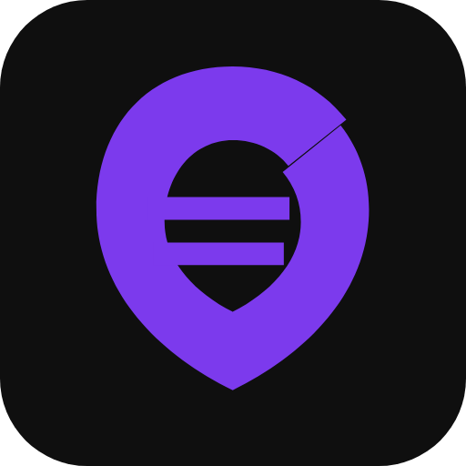

# Reel hero de pré-lançamento — Plano de Implementação

> **For agentic workers:** REQUIRED SUB-SKILL: Use superpowers:subagent-driven-development (recommended) or superpowers:executing-plans to implement this plan task-by-task. Steps use checkbox (`- [ ]`) syntax for tracking.

**Goal:** Produzir um Reel de 29s em 1080×1920 H.264 que mostra o Modo Live do Cifrô com captura real do app, mais o plano de conteúdo de quatro semanas.

**Architecture:** Uma página de palco HTML de 1080×1920 desenha fundo, molduras de celular e legendas. Duas páginas do Cifrô rodam em contextos de navegador separados (host e membro) e são fotografadas; suas capturas entram no palco como imagens. Um script Node percorre 870 índices de quadro, dirige o app nos pontos-chave, fotografa o palco a cada quadro e entrega os PNGs ao ffmpeg.

**Tech Stack:** Playwright (Chromium), Node 18+ ESM, PHP 8 built-in server, MySQL local, ffmpeg 9.0 (`libx264`), Inter via `@fontsource/inter`.

## Global Constraints

- **Banco:** a gravação roda exclusivamente contra `cifro_demo` em `127.0.0.1`. O script de seed aborta se `DB_HOST` não for `localhost`, `127.0.0.1` ou `::1`. Nunca contra `srv1576.hstgr.io`.
- **Direito autoral:** nenhuma letra de música de terceiro na tela. O repertório de demonstração é autoral, escrito neste plano.
- **Marcas:** nenhuma marca de terceiro visível. A cena do "app com propaganda" é genérica.
- **Saída:** `1080x1920`, H.264 `yuv420p`, 30 fps, **sem faixa de áudio** — a trilha é escolhida dentro do Instagram.
- **Zonas seguras do Reels:** nenhum texto ou elemento essencial acima de `y=220` nem abaixo de `y=1500`; margem direita de `120px` livre.
- **Marca:** violeta `#7c3aed`, fundo `#0e0e10`, tipografia Inter 700/800.
- **Duração:** 29,0s = 870 quadros a 30 fps.
- **Commits:** este repositório pertence ao usuário — **não rode `git commit`**. Onde o plano diz "ponto de commit", pare e avise o usuário que o bloco está pronto para ele commitar.
- **ffmpeg:** `C:\Users\felipe.negri\AppData\Local\Microsoft\WinGet\Packages\Gyan.FFmpeg_Microsoft.Winget.Source_8wekyb3d8bbwe\ffmpeg-9.0-full_build\bin\ffmpeg.exe`. Após reiniciar o shell, `ffmpeg` também resolve pelo PATH.

## Estrutura de arquivos

```
marketing/instagram/
  README.md                  # como rodar a gravação do zero
  seed-demo.php              # cria e popula o banco cifro_demo
  stage/
    stage.html               # palco 1080x1920 (fundo, celulares, legendas, mocks)
    stage.css                # design system premium
    timeline.js              # cenas, mapa de quadros, render(frame) determinístico
  record.mjs                 # Playwright: dirige o app e fotografa 870 quadros
  encode.mjs                 # PNGs -> mp4 via ffmpeg
  copy/plano-4-semanas.md    # legendas e hashtags das 12 peças
  out/                       # frames/ e reel.mp4 (ignorados pelo git)
tests/marketing/
  timeline.test.js           # node --test: mapa de quadros e render determinístico
```

Responsabilidades: `timeline.js` só decide **o que aparece no quadro N** e não sabe gravar; `record.mjs` só orquestra navegador e app e não sabe desenhar; `stage.css` concentra toda decisão visual. Trocar o roteiro é editar um array em `timeline.js`.

---

### Task 1: Banco de demonstração

**Files:**
- Create: `marketing/instagram/seed-demo.php`
- Modify: `package.json` (bloco `scripts`)

**Interfaces:**
- Produces: banco MySQL `cifro_demo` com banda `Banda Demo` (id `00000000-0000-4000-8000-0000000000d1`), usuários `host@demo.local` e `membro@demo.local` (senha `CifroDemo#2026!`), 6 músicas e 1 roteiro `Culto de Domingo`.

- [ ] **Step 1: Escrever o script de seed**

Create `marketing/instagram/seed-demo.php`:

```php
<?php
require_once __DIR__ . '/../../public/config/env.php';

$host = (string) env('DB_HOST', '127.0.0.1');
$port = (string) env('DB_PORT', '3306');
$user = (string) env('DB_USER', 'root');
$pass = (string) env('DB_PASS', '');
$database = 'cifro_demo';

if (!in_array($host, ['localhost', '127.0.0.1', '::1'], true)) {
    throw new RuntimeException("Seed de demonstracao permitido apenas em MySQL local. DB_HOST={$host}");
}
if ($database === trim((string) env('DB_NAME', ''))) {
    throw new RuntimeException('O banco de demonstracao nao pode ser o banco configurado em DB_NAME.');
}

$server = new PDO("mysql:host={$host};port={$port};charset=utf8mb4", $user, $pass, [PDO::ATTR_ERRMODE => PDO::ERRMODE_EXCEPTION]);
$server->exec("DROP DATABASE IF EXISTS `{$database}`");
$server->exec("CREATE DATABASE `{$database}` CHARACTER SET utf8mb4 COLLATE utf8mb4_unicode_ci");

$pdo = new PDO("mysql:host={$host};port={$port};dbname={$database};charset=utf8mb4", $user, $pass, [PDO::ATTR_ERRMODE => PDO::ERRMODE_EXCEPTION]);
$schema = file_get_contents(__DIR__ . '/../../create_tables.sql');
foreach (preg_split('/;\s*(?:\r?\n|$)/', preg_replace('/^\s*--.*$/m', '', $schema)) as $statement) {
    if (trim($statement) === '') continue;
    try { $pdo->exec($statement); }
    catch (PDOException $error) {
        if (!in_array((int)($error->errorInfo[1] ?? 0), [1060, 1061], true)) throw $error;
    }
}

$bandId   = '00000000-0000-4000-8000-0000000000d1';
$hostId   = '00000000-0000-4000-8000-0000000000d2';
$memberId = '00000000-0000-4000-8000-0000000000d3';
$password = password_hash('CifroDemo#2026!', PASSWORD_DEFAULT);

// Repertorio autoral: nenhuma letra de terceiro. So blocos de acorde e
// marcacoes de secao, que e o que aparece legivel na escala do video.
$cifra = static function (string $intro, string $verso, string $refrao): string {
    return "<p><b>[Intro]</b></p><p><b>{$intro}</b></p>"
         . "<p><b>[Verso]</b></p><p><b>{$verso}</b></p><p>Manha nova sobre a estrada,</p><p>o passo firme outra vez.</p>"
         . "<p><b>[Refrao]</b></p><p><b>{$refrao}</b></p><p>Canta comigo esse comeco,</p><p>que a noite ja passou.</p>";
};

$songs = [
    ['Amanhecer',        'Banda Demo', $cifra('G  D  Em  C', 'G  D  Em  C', 'C  G  D  Em'), '92'],
    ['Estrada Velha',    'Banda Demo', $cifra('D  A  Bm  G', 'D  A  Bm  G', 'G  D  A  Bm'), '108'],
    ['Casa Cheia',       'Banda Demo', $cifra('E  B  C#m  A', 'E  B  C#m  A', 'A  E  B  C#m'), '126'],
    ['Passo Firme',      'Banda Demo', $cifra('C  G  Am  F', 'C  G  Am  F', 'F  C  G  Am'), '84'],
    ['Luz da Manha',     'Banda Demo', $cifra('A  E  F#m  D', 'A  E  F#m  D', 'D  A  E  F#m'), '96'],
    ['Voltar pra Casa',  'Banda Demo', $cifra('F  C  Dm  Bb', 'F  C  Dm  Bb', 'Bb  F  C  Dm'), '72'],
];

$pdo->beginTransaction();
try {
    $pdo->prepare("INSERT INTO bandas (id,nome,ativo,plano) VALUES (?, 'Banda Demo', 1, 'gratuito')")->execute([$bandId]);

    $insertUser = $pdo->prepare("INSERT INTO usuarios (id,nome,email,senha_hash,perfil,ativo,plano) VALUES (?,?,?,?,?,1,'ativo')");
    $insertUser->execute([$hostId,   'Felipe',  'host@demo.local',   $password, 'master']);
    $insertUser->execute([$memberId, 'Juliana', 'membro@demo.local', $password, 'usuario']);

    $link = $pdo->prepare("INSERT INTO usuario_banda (usuario_id,banda_id,perfil) VALUES (?,?,?)");
    $link->execute([$hostId,   $bandId, 'administrador']);
    $link->execute([$memberId, $bandId, 'basico']);

    $insertSong = $pdo->prepare('INSERT INTO musicas (banda_id,nome,artista,cifra,bit) VALUES (?,?,?,?,?)');
    $songIds = [];
    foreach ($songs as [$nome, $artista, $cifraHtml, $bpm]) {
        $insertSong->execute([$bandId, $nome, $artista, $cifraHtml, $bpm]);
        $songIds[] = (int) $pdo->lastInsertId();
    }

    $pdo->prepare("INSERT INTO roteiros (banda_id,nome,conteudo) VALUES (?,?,?)")
        ->execute([$bandId, 'Culto de Domingo', json_encode($songIds)]);

    $pdo->commit();
} catch (Throwable $error) {
    $pdo->rollBack();
    throw $error;
}

echo "Banco de demonstracao pronto: {$database} (" . count($songs) . " musicas)\n";
```

- [ ] **Step 2: Conferir o schema real de `roteiros` antes de rodar**

O `INSERT INTO roteiros` acima assume as colunas `banda_id`, `nome` e `conteudo`. Verifique:

Run: `grep -A 12 "CREATE TABLE \`roteiros\`" create_tables.sql`

Se os nomes divergirem, ajuste o `INSERT` do Step 1 para as colunas reais **antes** de prosseguir. Mesma checagem vale para `musicas` (`nome`, `artista`, `cifra`, `bit`) — essas vieram de `scripts/setup/setup_e2e_db.php:41`, que já roda contra este schema, então devem estar corretas.

- [ ] **Step 3: Verificar que o guard de banco remoto funciona**

Run:
```bash
DB_HOST=srv1576.hstgr.io C:/xampp/php/php.exe marketing/instagram/seed-demo.php
```
Expected: falha com `Seed de demonstracao permitido apenas em MySQL local. DB_HOST=srv1576.hstgr.io`. Se rodar sem erro, **pare** — o guard não está protegendo produção.

- [ ] **Step 4: Rodar o seed de verdade**

Run: `C:/xampp/php/php.exe marketing/instagram/seed-demo.php`
Expected: `Banco de demonstracao pronto: cifro_demo (6 musicas)`

- [ ] **Step 5: Adicionar os scripts npm**

Modify `package.json`, no bloco `scripts`:

```json
"demo:seed": "C:/xampp/php/php.exe marketing/instagram/seed-demo.php",
"demo:serve": "C:/xampp/php/php.exe -S 127.0.0.1:8095 -t public router.php",
"demo:record": "node marketing/instagram/record.mjs",
"demo:encode": "node marketing/instagram/encode.mjs",
"demo:build": "npm run demo:record && npm run demo:encode"
```

- [ ] **Step 6: Verificar o login dos dois usuários**

Suba o servidor com o banco de demonstração:
```bash
DB_NAME=cifro_demo npm run demo:serve
```
Abra `http://127.0.0.1:8095/login.php`, entre com `host@demo.local` / `CifroDemo#2026!` e confirme que a lista mostra as 6 músicas e o roteiro `Culto de Domingo`. Repita com `membro@demo.local`. Derrube o servidor depois.

- [ ] **Step 7: Ponto de commit** — avise o usuário: seed de demonstração pronto, ele commita.

---

### Task 2: Design system do palco

**Files:**
- Create: `marketing/instagram/stage/stage.html`
- Create: `marketing/instagram/stage/stage.css`
- Modify: `.gitignore`

**Interfaces:**
- Produces: DOM com `#stage` (1080×1920), `#phone-left img.screen`, `#phone-right img.screen`, `#caption`, `#mock-layer`, `#logo-card`. Consumido pela Task 4 (`timeline.js`) e pela Task 5 (`record.mjs`).

- [ ] **Step 1: Ignorar a saída da gravação**

Modify `.gitignore`, acrescentando ao fim:

```
marketing/instagram/out/
```

- [ ] **Step 2: Escrever o palco**

Create `marketing/instagram/stage/stage.html`:

```html
<!doctype html>
<html lang="pt-BR">
<head>
  <meta charset="utf-8">
  <title>Cifrô — palco de gravação</title>
  <link rel="stylesheet" href="stage.css">
</head>
<body>
  <div id="stage">
    <div class="bg-glow"></div>
    <div class="bg-grain"></div>

    <div id="phone-layer">
      <div class="phone" id="phone-left">
        <div class="phone-bezel"></div>
        <span class="phone-label">host</span>
      </div>
      <div class="phone" id="phone-right">
        <div class="phone-bezel"></div>
        <span class="phone-label">banda</span>
      </div>
    </div>

    <div id="mock-layer"></div>

    <div id="logo-card">
      
      <div class="logo-word">Cifrô</div>
      <div class="logo-line">Em breve.</div>
      <div class="logo-sub">segue aqui pra acompanhar</div>
    </div>

    <div id="caption"><span class="caption-text"></span></div>
  </div>
  <script src="timeline.js"></script>
</body>
</html>
```

- [ ] **Step 3: Escrever o design system**

Create `marketing/instagram/stage/stage.css`:

```css
@font-face { font-family: Inter; font-weight: 600; font-display: block;
  src: url("../../../node_modules/@fontsource/inter/files/inter-latin-600-normal.woff2") format("woff2"); }
@font-face { font-family: Inter; font-weight: 700; font-display: block;
  src: url("../../../node_modules/@fontsource/inter/files/inter-latin-700-normal.woff2") format("woff2"); }
@font-face { font-family: Inter; font-weight: 800; font-display: block;
  src: url("../../../node_modules/@fontsource/inter/files/inter-latin-800-normal.woff2") format("woff2"); }

:root {
  --brand: #7c3aed;
  --bg: #0e0e10;
  --ink: #f4f4f5;
  --muted: #a1a1aa;
  /* Zonas seguras do Reels: nada essencial fora desta faixa. */
  --safe-top: 220px;
  --safe-bottom: 1500px;
}

* { margin: 0; padding: 0; box-sizing: border-box; }

body { background: #000; }

#stage {
  position: relative; width: 1080px; height: 1920px; overflow: hidden;
  background: var(--bg); font-family: Inter, sans-serif; color: var(--ink);
}

/* Halo violeta atrás dos celulares — dá profundidade sem competir com o app. */
.bg-glow {
  position: absolute; inset: 0;
  background:
    radial-gradient(900px 700px at 50% 42%, rgba(124,58,237,.28), transparent 70%),
    radial-gradient(700px 900px at 15% 85%, rgba(124,58,237,.10), transparent 70%);
}
/* Grão sutil: mata o banding dos gradientes na compressão do Instagram. */
.bg-grain {
  position: absolute; inset: 0; opacity: .05; mix-blend-mode: overlay;
  background-image: url("data:image/svg+xml,%3Csvg xmlns='http://www.w3.org/2000/svg' width='140' height='140'%3E%3Cfilter id='n'%3E%3CfeTurbulence baseFrequency='.85' numOctaves='3'/%3E%3C/filter%3E%3Crect width='140' height='140' filter='url(%23n)'/%3E%3C/svg%3E");
}

#phone-layer {
  position: absolute; left: 0; right: 0; top: 300px;
  display: flex; justify-content: center; align-items: flex-start; gap: 48px;
}

.phone { position: relative; opacity: 0; }

.phone-bezel {
  width: 430px; height: 900px; padding: 12px; border-radius: 54px;
  background: linear-gradient(160deg, #3a3a42, #131317 55%, #2a2a31);
  box-shadow:
    0 2px 0 rgba(255,255,255,.14) inset,
    0 40px 90px rgba(0,0,0,.65),
    0 8px 24px rgba(0,0,0,.5),
    0 0 0 1px rgba(255,255,255,.06);
}
.phone-bezel .screen {
  display: block; width: 100%; height: 100%; border-radius: 42px;
  object-fit: cover; object-position: top center; background: var(--bg);
}
.phone-label {
  position: absolute; left: 0; right: 0; top: -46px; text-align: center;
  font-size: 26px; font-weight: 600; letter-spacing: .18em; text-transform: uppercase;
  color: var(--muted);
}

/* Anel violeta que pulsa no instante em que a tela da banda troca sozinha. */
.phone.flash .phone-bezel {
  box-shadow:
    0 2px 0 rgba(255,255,255,.14) inset,
    0 40px 90px rgba(0,0,0,.65),
    0 0 0 6px rgba(124,58,237,.85),
    0 0 90px 18px rgba(124,58,237,.55);
}

#mock-layer {
  position: absolute; left: 90px; top: 300px; width: 900px; height: 900px;
  display: none; border-radius: 32px; overflow: hidden;
}

#caption {
  position: absolute; left: 90px; right: 120px; top: 1240px;
  opacity: 0; text-align: center;
}
.caption-text {
  display: inline-block; font-size: 68px; line-height: 1.16; font-weight: 800;
  letter-spacing: -.02em; text-wrap: balance;
  text-shadow: 0 4px 30px rgba(0,0,0,.75);
}
.caption-text em { font-style: normal; color: #a78bfa; }

#logo-card {
  position: absolute; inset: 0; display: flex; flex-direction: column;
  align-items: center; justify-content: center; gap: 20px; opacity: 0;
  background: var(--bg);
}
#logo-card img { width: 190px; height: 190px; border-radius: 44px;
  box-shadow: 0 30px 70px rgba(124,58,237,.35); }
.logo-word { font-size: 96px; font-weight: 800; letter-spacing: -.03em; }
.logo-line { font-size: 60px; font-weight: 700; color: #a78bfa; }
.logo-sub  { font-size: 34px; font-weight: 600; color: var(--muted); }
```

- [ ] **Step 4: Conferir o palco vazio**

Rode um servidor estático e fotografe o palco:
```bash
npx --yes http-server marketing/instagram/stage -p 8099 --silent
```
Em outro terminal, com Playwright:
```bash
node -e "const{chromium}=require('playwright');(async()=>{const b=await chromium.launch();const p=await b.newPage({viewport:{width:1080,height:1920}});await p.goto('http://127.0.0.1:8099/stage.html');await p.waitForTimeout(600);await p.screenshot({path:'marketing/instagram/out/stage-check.png'});await b.close();})()"
```
Expected: PNG de 1080×1920 com fundo escuro e halo violeta. Abra e confirme que não há barra de rolagem nem faixa branca nas bordas. Derrube o `http-server`.

- [ ] **Step 5: Ponto de commit** — palco e design system prontos.

---

### Task 3: Cenas de dor (mocks)

**Files:**
- Modify: `marketing/instagram/stage/stage.css` (acrescentar bloco de mocks ao fim)
- Modify: `marketing/instagram/stage/stage.html` (preencher `#mock-layer`)

**Interfaces:**
- Produces: três elementos `.mock` com `data-mock="paper" | "chat" | "adapp"` dentro de `#mock-layer`, exibidos por `timeline.js` (Task 4) via `data-mock`.

**Restrição:** nenhuma marca de terceiro. O mock de conversa é um balão genérico sem cabeçalho de aplicativo; o mock de propaganda usa um banner com a palavra "Publicidade".

- [ ] **Step 1: Preencher o `#mock-layer`**

Modify `marketing/instagram/stage/stage.html` — troque `<div id="mock-layer"></div>` por:

```html
    <div id="mock-layer">
      <div class="mock" data-mock="paper">
        <div class="paper-sheet">
          <div class="paper-title">Culto de Domingo</div>
          <ol class="paper-list">
            <li>Amanhecer</li>
            <li class="struck">Estrada Velha</li>
            <li>Casa Cheia</li>
            <li class="struck">Passo Firme</li>
            <li>Luz da Manha</li>
          </ol>
          <div class="paper-scribble">mudou!</div>
        </div>
      </div>

      <div class="mock" data-mock="chat">
        <div class="chat-bubble in">alguem tem a cifra de Casa Cheia?</div>
        <div class="chat-bubble out"><span class="chat-shot">C&nbsp;&nbsp;G&nbsp;&nbsp;Am&nbsp;&nbsp;F</span></div>
        <div class="chat-bubble in">esse print ta em C, eu toco em E</div>
      </div>

      <div class="mock" data-mock="adapp">
        <div class="ad-page">
          <div class="ad-chords">E&nbsp;&nbsp;B&nbsp;&nbsp;C#m&nbsp;&nbsp;A</div>
          <div class="ad-chords">E&nbsp;&nbsp;B&nbsp;&nbsp;C#m&nbsp;&nbsp;A</div>
          <div class="ad-banner">Publicidade</div>
          <div class="ad-chords dim">A&nbsp;&nbsp;E&nbsp;&nbsp;B&nbsp;&nbsp;C#m</div>
        </div>
      </div>
    </div>
```

- [ ] **Step 2: Estilizar os mocks**

Modify `marketing/instagram/stage/stage.css`, acrescentando ao fim:

```css
.mock { display: none; width: 900px; height: 900px; }
.mock.active { display: block; }

/* Papel: folha impressa, levemente torta, riscada a caneta. */
[data-mock="paper"] .paper-sheet {
  width: 100%; height: 100%; background: #f6f3ea; color: #26262b;
  border-radius: 10px; padding: 80px 70px; transform: rotate(-1.6deg);
  box-shadow: 0 40px 90px rgba(0,0,0,.6);
  font-size: 46px; position: relative;
}
.paper-title { font-weight: 800; font-size: 54px; margin-bottom: 40px; }
.paper-list { padding-left: 60px; line-height: 1.9; }
.paper-list .struck { text-decoration: line-through; text-decoration-thickness: 4px;
  text-decoration-color: #1e40af; opacity: .55; }
.paper-scribble {
  position: absolute; right: 90px; bottom: 130px; transform: rotate(-9deg);
  color: #1e40af; font-size: 62px; font-weight: 700;
}

/* Conversa: baloes genericos, sem cabecalho de aplicativo nenhum. */
[data-mock="chat"] { display: none; flex-direction: column; gap: 30px; justify-content: center; padding: 60px; }
[data-mock="chat"].active { display: flex; }
.chat-bubble { max-width: 78%; padding: 30px 36px; border-radius: 30px; font-size: 40px; line-height: 1.35; }
.chat-bubble.in  { align-self: flex-start; background: #26262b; color: var(--ink); border-bottom-left-radius: 8px; }
.chat-bubble.out { align-self: flex-end;  background: #1f3a2e; color: #d7f5e5; border-bottom-right-radius: 8px; }
.chat-shot { display: block; background: #0b0b0d; color: #d4d4d8; border-radius: 12px;
  padding: 40px 30px; font-family: "JetBrains Mono", monospace; font-size: 38px; filter: blur(.4px); }

/* App generico com propaganda cobrindo o refrao. */
[data-mock="adapp"] .ad-page {
  width: 100%; height: 100%; background: #15151a; border-radius: 32px;
  padding: 80px 60px; display: flex; flex-direction: column; gap: 44px;
}
.ad-chords { font-family: "JetBrains Mono", monospace; font-size: 48px; font-weight: 700; color: #e4e4e7; }
.ad-chords.dim { opacity: .25; }
.ad-banner {
  background: repeating-linear-gradient(45deg, #f59e0b, #f59e0b 22px, #d97706 22px, #d97706 44px);
  color: #1c1917; font-weight: 800; font-size: 44px; text-align: center;
  padding: 70px 0; border-radius: 14px; margin: 10px 0;
  box-shadow: 0 20px 50px rgba(0,0,0,.6);
}
```

- [ ] **Step 3: Conferir os três mocks**

Suba `npx --yes http-server marketing/instagram/stage -p 8099 --silent` e, para cada valor de `mock` em `paper`, `chat`, `adapp`, rode no console da página:
```js
document.getElementById('mock-layer').style.display = 'block';
document.querySelectorAll('.mock').forEach(m => m.classList.remove('active'));
document.querySelector('[data-mock="paper"]').classList.add('active');
```
Expected: os três renderizam dentro do quadrado de 900×900, sem estouro. Confirme visualmente que nenhum deles exibe marca de terceiro.

- [ ] **Step 4: Ponto de commit** — mocks das cenas de dor prontos.

---

### Task 4: Timeline determinística

**Files:**
- Create: `marketing/instagram/stage/timeline.js`
- Create: `tests/marketing/timeline.test.js`

**Interfaces:**
- Consumes: o DOM da Task 2 e os mocks da Task 3.
- Produces:
  - `window.STAGE.FPS` = `30`, `window.STAGE.TOTAL_FRAMES` = `870`
  - `window.STAGE.sceneAt(frame)` → objeto `{ id, from, to, layout, caption, mock }`
  - `window.STAGE.render(frame)` → aplica o estado do quadro ao DOM, sem animação dependente de relógio
  - `window.STAGE.KEYFRAMES` → `{ liveFlip: 300, transpose: 450, scroll: 540 }`, lido por `record.mjs`

`render` é puro em relação ao tempo: chamar `render(N)` duas vezes produz pixels idênticos. Nenhuma animação CSS com `animation`/`transition` — toda interpolação é calculada em JS a partir do índice do quadro.

- [ ] **Step 1: Escrever o teste que falha**

Create `tests/marketing/timeline.test.js`:

```js
import test from 'node:test';
import assert from 'node:assert/strict';
import fs from 'node:fs';
import vm from 'node:vm';

const source = fs.readFileSync('marketing/instagram/stage/timeline.js', 'utf8');

function loadTimeline() {
  const context = { window: {}, document: { querySelector: () => null, querySelectorAll: () => [], getElementById: () => null } };
  context.globalThis = context;
  vm.createContext(context);
  vm.runInContext(source, context);
  return context.window.STAGE;
}

test('a timeline cobre 870 quadros a 30 fps', () => {
  const stage = loadTimeline();
  assert.equal(stage.FPS, 30);
  assert.equal(stage.TOTAL_FRAMES, 870);
});

test('as cenas cobrem a linha do tempo inteira sem buraco nem sobreposicao', () => {
  const stage = loadTimeline();
  const scenes = stage.SCENES;
  assert.equal(scenes[0].from, 0);
  assert.equal(scenes.at(-1).to, 870);
  for (let i = 1; i < scenes.length; i += 1) {
    assert.equal(scenes[i].from, scenes[i - 1].to, `buraco ou sobreposicao antes da cena ${scenes[i].id}`);
  }
});

test('todo quadro valido resolve para exatamente uma cena', () => {
  const stage = loadTimeline();
  for (let frame = 0; frame < 870; frame += 1) {
    const scene = stage.sceneAt(frame);
    assert.ok(scene, `quadro ${frame} sem cena`);
    assert.ok(frame >= scene.from && frame < scene.to);
  }
});

test('os keyframes de acao caem dentro das cenas de app correspondentes', () => {
  const stage = loadTimeline();
  assert.equal(stage.sceneAt(stage.KEYFRAMES.liveFlip).id, 'live');
  assert.equal(stage.sceneAt(stage.KEYFRAMES.transpose).id, 'transpose');
  assert.equal(stage.sceneAt(stage.KEYFRAMES.scroll).id, 'scroll');
  assert.equal(stage.sceneAt(stage.KEYFRAMES.setlist).id, 'roteiro');
  assert.equal(stage.sceneAt(stage.KEYFRAMES.rehearsal).id, 'ensaio');
  assert.equal(stage.sceneAt(stage.KEYFRAMES.offline).id, 'offline');
});

test('cada keyframe cai no primeiro quadro da sua cena, para a acao valer a cena inteira', () => {
  const stage = loadTimeline();
  for (const [name, frame] of Object.entries(stage.KEYFRAMES)) {
    const scene = stage.sceneAt(frame);
    if (['setlist', 'rehearsal', 'offline'].includes(name)) {
      assert.equal(frame, scene.from, `keyframe ${name} deveria abrir a cena ${scene.id}`);
    }
  }
});
```

- [ ] **Step 2: Rodar o teste e ver falhar**

Run: `node --test tests/marketing/timeline.test.js`
Expected: FAIL — `ENOENT: no such file or directory, open 'marketing/instagram/stage/timeline.js'`

- [ ] **Step 3: Escrever a timeline**

Create `marketing/instagram/stage/timeline.js`:

```js
(function () {
  const FPS = 30;
  const TOTAL_FRAMES = 870; // 29,0s

  // Cada cena declara o layout, a legenda e o mock. `to` e exclusivo.
  const SCENES = [
    { id: 'hook',      from:   0, to:  60, layout: 'duo',  mock: null,    caption: 'Quando muda a ordem do repertório' },
    { id: 'paper',     from:  60, to: 120, layout: 'mock', mock: 'paper', caption: 'a folha impressa já era' },
    { id: 'chat',      from: 120, to: 180, layout: 'mock', mock: 'chat',  caption: 'o print do grupo não tá no seu tom' },
    { id: 'adapp',     from: 180, to: 240, layout: 'mock', mock: 'adapp', caption: 'e o app tem propaganda no meio do refrão' },
    { id: 'live',      from: 240, to: 420, layout: 'duo',  mock: null,    caption: 'o host troca. <em>todo mundo acompanha.</em>' },
    { id: 'transpose', from: 420, to: 510, layout: 'solo', mock: null,    caption: 'e cada um no seu tom' },
    { id: 'scroll',    from: 510, to: 600, layout: 'solo', mock: null,    caption: '' },
    { id: 'roteiro',   from: 600, to: 660, layout: 'solo', mock: null,    caption: 'o roteiro pronto antes do show' },
    { id: 'ensaio',    from: 660, to: 720, layout: 'solo', mock: null,    caption: 'ensaia o trecho difícil em loop' },
    { id: 'offline',   from: 720, to: 780, layout: 'solo', mock: null,    caption: 'e funciona sem internet' },
    { id: 'logo',      from: 780, to: 870, layout: 'logo', mock: null,    caption: '' },
  ];

  // Quadros em que record.mjs dispara uma acao real no app. Os tres ultimos
  // sao as cenas de reforco, cada uma numa tela diferente do Cifro.
  const KEYFRAMES = {
    liveFlip: 300, transpose: 450, scroll: 540,
    setlist: 600, rehearsal: 660, offline: 720,
  };

  const FLASH_FRAMES = 9; // duracao do anel violeta apos a troca

  function sceneAt(frame) {
    return SCENES.find(scene => frame >= scene.from && frame < scene.to) || null;
  }

  // Saida suave: rapida no inicio, assenta no fim. Mesma curva do easing
  // cubic-bezier(.16,1,.3,1), mas calculada por quadro para ser deterministica.
  function easeOut(t) {
    const clamped = Math.min(Math.max(t, 0), 1);
    return 1 - Math.pow(1 - clamped, 3);
  }

  // Progresso 0..1 de uma entrada de `frames` quadros a partir do inicio da cena.
  function entry(frame, scene, frames) {
    return easeOut((frame - scene.from) / frames);
  }

  function render(frame) {
    const scene = sceneAt(frame);
    if (!scene) return;

    const stage    = document.getElementById('stage');
    const phones   = document.getElementById('phone-layer');
    const mockWrap = document.getElementById('mock-layer');
    const caption  = document.getElementById('caption');
    const logo     = document.getElementById('logo-card');
    const left     = document.getElementById('phone-left');
    const right    = document.getElementById('phone-right');

    stage.dataset.scene = scene.id;

    // --- celulares ---
    const showPhones = scene.layout === 'duo' || scene.layout === 'solo';
    phones.style.display = showPhones ? 'flex' : 'none';
    if (showPhones) {
      const p = entry(frame, scene, 12);
      const solo = scene.layout === 'solo';
      left.style.opacity  = String(p);
      left.style.transform = `translateY(${(1 - p) * 28}px) scale(${solo ? 1.18 : 1})`;
      right.style.opacity = solo ? '0' : String(p);
      right.style.transform = `translateY(${(1 - p) * 28}px)`;
      right.style.display = solo ? 'none' : 'block';
    }

    // --- anel violeta no instante da troca ---
    const flashing = frame >= KEYFRAMES.liveFlip && frame < KEYFRAMES.liveFlip + FLASH_FRAMES;
    right.classList.toggle('flash', flashing);

    // --- mocks ---
    mockWrap.style.display = scene.layout === 'mock' ? 'block' : 'none';
    document.querySelectorAll('.mock').forEach(node => {
      node.classList.toggle('active', scene.layout === 'mock' && node.dataset.mock === scene.mock);
    });

    // --- legenda ---
    const text = caption.querySelector('.caption-text');
    if (!scene.caption) {
      caption.style.opacity = '0';
    } else {
      if (text.dataset.for !== scene.id) {
        text.innerHTML = scene.caption;
        text.dataset.for = scene.id;
      }
      const p = entry(frame, scene, 15);
      caption.style.opacity = String(p);
      caption.style.transform = `translateY(${(1 - p) * 22}px)`;
    }

    // --- cartao final ---
    logo.style.opacity = scene.layout === 'logo' ? String(entry(frame, scene, 18)) : '0';
  }

  window.STAGE = { FPS, TOTAL_FRAMES, SCENES, KEYFRAMES, sceneAt, render };
})();
```

- [ ] **Step 4: Rodar o teste e ver passar**

Run: `node --test tests/marketing/timeline.test.js`
Expected: PASS, 4 testes.

- [ ] **Step 5: Registrar o teste no npm**

Modify `package.json` — a chave `test:unit:js` hoje é:
```
"test:unit:js": "node --test tests/chords.test.js tests/music-youtube-panel-state.test.js",
```
Acrescente o novo arquivo ao fim da lista:
```
"test:unit:js": "node --test tests/chords.test.js tests/music-youtube-panel-state.test.js tests/marketing/timeline.test.js",
```

Run: `npm run test:unit:js`
Expected: PASS, todos os arquivos.

- [ ] **Step 6: Ponto de commit** — timeline determinística com testes.

---

### Task 5: Captura quadro a quadro

**Files:**
- Create: `marketing/instagram/record.mjs`

**Interfaces:**
- Consumes: `window.STAGE.{TOTAL_FRAMES, KEYFRAMES, sceneAt, render}` (Task 4); banco `cifro_demo` (Task 1).
- Produces: `marketing/instagram/out/frames/frame-000000.png` … `frame-000869.png`, em 1080×1920. Consumido pela Task 6.

**Como funciona:** três páginas Playwright — `stagePage` (o palco, 1080×1920) e duas páginas de app em contextos separados, `hostPage` e `memberPage`, cada uma com 430×900 e sessão própria. A cada quadro o script decide se precisa refotografar as telas do app; nas cenas paradas reaproveita a última foto, e na janela do Modo Live refotografa a cada quadro para captar o movimento real.

**Como o Modo Live funciona de verdade** (verificado em `public/src/js/live.js:147-180`, antes de escrever este código):

- O host só publica estado quando está em **`music.php?id=N`**. Em `roteiro.php` a função `currentPageState()` devolve `podePublicar: false` — clicar dentro do roteiro **não** dispara nada. O gatilho é a **navegação entre músicas**.
- O membro segue via `window.location.href = status.paginaAtual` (`live.js:453`), ou seja, a tela dele troca porque o navegador dele navega.
- O setlist do app é a tabela **`playlists`** (`itens` = `[{id, tom}]`), não `roteiros` — `roteiros` é texto livre. A playlist `Culto de Domingo` semeada na Task 1 é o que a demonstração usa, e ela carrega o tom por música, que aparece na URL como `playlistTom`.

Portanto: o host começa em `music.php?id=<primeira da playlist>`, o membro assume o papel de seguidor, e no quadro-chave o host navega para a próxima música da playlist.

- [ ] **Step 1: Escrever o gravador**

Create `marketing/instagram/record.mjs`:

```js
import { chromium } from '@playwright/test';
import fs from 'node:fs/promises';
import path from 'node:path';
import { spawn } from 'node:child_process';
import { fileURLToPath, pathToFileURL } from 'node:url';

const DIR = path.dirname(fileURLToPath(import.meta.url));
const OUT = path.join(DIR, 'out', 'frames');
const APP = 'http://127.0.0.1:8095';
// Casa exatamente com a tela interna de .phone-bezel no stage.css
// (400x850 menos 12px de padding em volta) — evita corte no object-fit.
const PHONE = { width: 376, height: 826 };
const CREDS = {
  host:   { email: 'host@demo.local',   password: 'CifroDemo#2026!' },
  member: { email: 'membro@demo.local', password: 'CifroDemo#2026!' },
};

// Janelas em que a tela do app se move de verdade e precisa ser refotografada
// a cada quadro. Fora delas, reaproveitamos a ultima foto — o app esta parado.
const LIVE_WINDOWS = [[288, 340], [444, 470], [510, 600]];

function startServer() {
  const server = spawn('C:/xampp/php/php.exe', ['-S', '127.0.0.1:8095', '-t', 'public', 'router.php'], {
    cwd: path.join(DIR, '..', '..'),
    env: { ...process.env, DB_NAME: 'cifro_demo', APP_ENV: 'development' },
    stdio: 'ignore',
  });
  return server;
}

async function waitForServer() {
  for (let attempt = 0; attempt < 40; attempt += 1) {
    try {
      const response = await fetch(`${APP}/login.php`);
      if (response.ok) return;
    } catch { /* servidor ainda subindo */ }
    await new Promise(resolve => setTimeout(resolve, 250));
  }
  throw new Error('Servidor de demonstracao nao subiu em 10s.');
}

async function login(browser, { email, password }) {
  const context = await browser.newContext({ viewport: PHONE, deviceScaleFactor: 2 });
  const page = await context.newPage();
  await page.goto(`${APP}/login.php`);
  await page.fill('input[type="email"], input[name="email"]', email);
  await page.fill('input[type="password"], input[name="senha"]', password);
  await page.click('button[type="submit"]');
  await page.waitForLoadState('networkidle');
  return page;
}

async function shoot(page) {
  return (await page.screenshot({ type: 'png' })).toString('base64');
}

async function paint(stagePage, side, base64) {
  await stagePage.evaluate(([selector, data]) => {
    document.querySelector(selector).src = `data:image/png;base64,${data}`;
  }, [`#phone-${side} .screen`, base64]);
}

const inLiveWindow = frame => LIVE_WINDOWS.some(([from, to]) => frame >= from && frame < to);

async function main() {
  await fs.rm(OUT, { recursive: true, force: true });
  await fs.mkdir(OUT, { recursive: true });

  const server = startServer();
  try {
    await waitForServer();
    const browser = await chromium.launch();

    const hostPage = await login(browser, CREDS.host);
    const memberPage = await login(browser, CREDS.member);

    const stageContext = await browser.newContext({ viewport: { width: 1080, height: 1920 } });
    const stagePage = await stageContext.newPage();
    await stagePage.goto(pathToFileURL(path.join(DIR, 'stage', 'stage.html')).href);
    await stagePage.waitForFunction(() => window.STAGE && document.fonts.status === 'loaded');

    // Estado inicial: os dois na primeira musica da playlist Culto de Domingo.
    // O host precisa estar em music.php para poder publicar estado (live.js:147-165).
    const SETLIST = [
      { id: 1, tom: 'G' }, { id: 2, tom: 'D' }, { id: 3, tom: 'E' },
      { id: 4, tom: 'C' }, { id: 5, tom: 'A' }, { id: 6, tom: 'F' },
    ];
    const songUrl = ({ id, tom }) => `${APP}/music.php?id=${id}&playlistTom=${tom}`;

    await hostPage.goto(songUrl(SETLIST[0]));
    await memberPage.goto(songUrl(SETLIST[0]));
    await hostPage.waitForLoadState('networkidle');
    await memberPage.waitForLoadState('networkidle');

    // O host assume o comando; o membro passa a seguir.
    await hostPage.click('[data-live-host], #live-host, .live-indicator');
    await hostPage.waitForTimeout(1200);

    const { TOTAL_FRAMES, KEYFRAMES } = await stagePage.evaluate(() => ({
      TOTAL_FRAMES: window.STAGE.TOTAL_FRAMES,
      KEYFRAMES: window.STAGE.KEYFRAMES,
    }));

    await paint(stagePage, 'left', await shoot(hostPage));
    await paint(stagePage, 'right', await shoot(memberPage));

    for (let frame = 0; frame < TOTAL_FRAMES; frame += 1) {
      // Acoes reais no app, disparadas no quadro exato.
      // O host navega para a proxima musica da playlist. A tela do membro
      // troca sozinha porque live.js:453 leva o navegador dele para paginaAtual.
      if (frame === KEYFRAMES.liveFlip) {
        await hostPage.goto(songUrl(SETLIST[2]));
      }
      if (frame === KEYFRAMES.transpose) {
        await hostPage.click('[data-transpose="up"], #btn-tom-up');
      }
      if (frame === KEYFRAMES.scroll) {
        await hostPage.evaluate(() => window.scrollBy({ top: 420, behavior: 'smooth' }));
      }

      // Cenas de reforco: cada uma numa tela diferente do app.
      if (frame === KEYFRAMES.setlist) {
        await hostPage.goto(`${APP}/editorplaylist.php`);
        await hostPage.waitForLoadState('networkidle');
        await paint(stagePage, 'left', await shoot(hostPage));
      }
      if (frame === KEYFRAMES.rehearsal) {
        await hostPage.goto(`${APP}/ensaio.php?id=${SETLIST[0].id}`);
        await hostPage.waitForLoadState('networkidle');
        await paint(stagePage, 'left', await shoot(hostPage));
      }
      if (frame === KEYFRAMES.offline) {
        // Offline de verdade: corta a rede e recarrega. Se o service worker
        // servir a pagina do cache, a alegacao do video se sustenta.
        await hostPage.goto(songUrl(SETLIST[0]));
        await hostPage.waitForLoadState('networkidle');
        await hostPage.context().setOffline(true);
        await hostPage.reload({ waitUntil: 'domcontentloaded' });
        await paint(stagePage, 'left', await shoot(hostPage));
      }

      if (inLiveWindow(frame)) {
        await paint(stagePage, 'left', await shoot(hostPage));
        await paint(stagePage, 'right', await shoot(memberPage));
      }

      await stagePage.evaluate(n => window.STAGE.render(n), frame);
      await stagePage.screenshot({
        path: path.join(OUT, `frame-${String(frame).padStart(6, '0')}.png`),
      });

      if (frame % 60 === 0) process.stdout.write(`quadro ${frame}/${TOTAL_FRAMES}\n`);
    }

    await browser.close();
    console.log(`Pronto: ${TOTAL_FRAMES} quadros em ${OUT}`);
  } finally {
    server.kill();
  }
}

main().catch(error => { console.error(error); process.exit(1); });
```

- [ ] **Step 2: Descobrir os seletores reais do app**

Os seletores em `Step 1` (`[data-live-host]`, `#btn-tom-up`, `input[name="senha"]`) são palpites. Confirme cada um antes de rodar a gravação inteira:

Run: `grep -rn "data-transpose\|btn-tom\|tom-up\|transpor\|id=\"tom\"" public/src/js/music-view.js public/src/Views/music.php | head -20`
Run: `grep -n "name=\"senha\"\|name=\"password\"\|type=\"email\"" public/src/Views/*.php public/login.php | head`
Run: `grep -rn "assumirHost\|host.php\|live-indicator\|liveHost" public/src/js/live.js public/src/Views/partials/topnav.php | head -20`

Substitua os seletores no `record.mjs` pelos reais. Se um seletor não existir, **pare e reporte** em vez de inventar outro.

Confirme também **como o membro entra no modo seguidor**: leia `public/src/js/live.js` em volta da linha 453 (`window.location.href = status.paginaAtual`) e descubra se seguir é automático ao detectar um host ativo, ou se exige uma ação do usuário. Se exigir ação, acrescente o clique correspondente em `memberPage` logo após o host assumir.

**Não use `roteiro.php` para disparar o Live.** `currentPageState()` devolve `podePublicar: false` nessa página (`live.js:170-176`).

Confirme também os caminhos das três cenas de reforço, que também são palpites:

Run: `ls public/*.php | grep -iE "playlist|ensaio|rehearsal"`

Se `editorplaylist.php` ou `ensaio.php` tiverem outro nome, corrija as URLs. Se a página de ensaio exigir um áudio carregado para mostrar o loop A/B, **pare e reporte** — carregar áudio é decisão de escopo, não improvise.

- [ ] **Step 2b: Provar que a cena offline é honesta**

O vídeo afirma "funciona sem internet". Isso precisa ser verdade, não encenação. Antes da gravação completa, teste isolado:

```bash
node -e "const{chromium}=require('playwright');(async()=>{const b=await chromium.launch();const c=await b.newContext({viewport:{width:430,height:900}});const p=await c.newPage();/* faça login, abra music.php?id=1, espere o service worker registrar */ await p.waitForTimeout(3000);await c.setOffline(true);await p.reload({waitUntil:'domcontentloaded'});console.log(await p.title());await p.screenshot({path:'marketing/instagram/out/offline-check.png'});await b.close();})()"
```

Expected: a captura mostra a cifra, não a tela de dinossauro do Chrome nem uma página de erro. Se mostrar erro, o service worker não cobriu essa rota offline — **pare e reporte**. Nesse caso a cena precisa ser refeita ou cortada; não grave uma alegação falsa.

- [ ] **Step 3: Gravação curta de sanidade**

Antes dos 870 quadros, grave só os 60 primeiros. Troque temporariamente a condição do laço para `frame < 60`, rode:

Run: `npm run demo:record`
Expected: `quadro 0/870` e 60 PNGs em `marketing/instagram/out/frames/`.

Abra `frame-000000.png` e `frame-000059.png`. Confirme: dois celulares visíveis com a tela real do Cifrô dentro, legenda "Quando muda a ordem do repertório" surgindo de baixo, nada de dado real de usuário na tela. Devolva o laço para `frame < TOTAL_FRAMES`.

- [ ] **Step 4: Gravação completa**

Run: `npm run demo:record`
Expected: `Pronto: 870 quadros`. Leva alguns minutos.

Run: `ls marketing/instagram/out/frames | wc -l`
Expected: `870`

- [ ] **Step 5: Conferir o momento do Modo Live**

Abra `frame-000299.png` (antes) e `frame-000310.png` (depois). Expected: a tela do celular da direita mostra músicas **diferentes** nos dois quadros, e em `frame-000302.png` o anel violeta está aceso na moldura direita. Se as duas telas forem iguais, a sincronização Live não propagou — aumente a janela `LIVE_WINDOWS[0]` e verifique o intervalo de polling em `public/src/js/live.js`.

- [ ] **Step 6: Ponto de commit** — gravador pronto (os PNGs ficam fora do git).

---

### Task 6: Codificação para mp4

**Files:**
- Create: `marketing/instagram/encode.mjs`

**Interfaces:**
- Consumes: `marketing/instagram/out/frames/frame-%06d.png` (Task 5).
- Produces: `marketing/instagram/out/reel.mp4` — H.264, `yuv420p`, 1080×1920, 30 fps, sem áudio.

- [ ] **Step 1: Escrever o codificador**

Create `marketing/instagram/encode.mjs`:

```js
import { spawnSync } from 'node:child_process';
import fs from 'node:fs';
import path from 'node:path';
import { fileURLToPath } from 'node:url';

const DIR = path.dirname(fileURLToPath(import.meta.url));
const FRAMES = path.join(DIR, 'out', 'frames', 'frame-%06d.png');
const OUTPUT = path.join(DIR, 'out', 'reel.mp4');

const WINGET_FFMPEG = path.join(
  process.env.LOCALAPPDATA,
  'Microsoft/WinGet/Packages/Gyan.FFmpeg_Microsoft.Winget.Source_8wekyb3d8bbwe/ffmpeg-9.0-full_build/bin/ffmpeg.exe',
);
const FFMPEG = fs.existsSync(WINGET_FFMPEG) ? WINGET_FFMPEG : 'ffmpeg';

const result = spawnSync(FFMPEG, [
  '-y',
  '-framerate', '30',
  '-i', FRAMES,
  '-an',                        // sem audio: a trilha entra no app do Instagram
  '-c:v', 'libx264',
  '-preset', 'slow',
  '-crf', '18',                 // praticamente sem perda visivel
  '-pix_fmt', 'yuv420p',        // exigido por players moveis
  '-movflags', '+faststart',
  '-r', '30',
  OUTPUT,
], { stdio: 'inherit' });

if (result.status !== 0) {
  console.error('ffmpeg falhou.');
  process.exit(1);
}
console.log(`Reel pronto: ${OUTPUT}`);
```

- [ ] **Step 2: Codificar**

Run: `npm run demo:encode`
Expected: `Reel pronto: ...out\reel.mp4`

- [ ] **Step 3: Verificar o arquivo contra as exigências do Instagram**

Run:
```bash
"$LOCALAPPDATA/Microsoft/WinGet/Packages/Gyan.FFmpeg_Microsoft.Winget.Source_8wekyb3d8bbwe/ffmpeg-9.0-full_build/bin/ffprobe.exe" -v error -show_entries stream=codec_name,width,height,r_frame_rate,pix_fmt -show_entries format=duration -of default=noprint_wrappers=1 marketing/instagram/out/reel.mp4
```
Expected, exatamente:
- `codec_name=h264`
- `width=1080`, `height=1920`
- `r_frame_rate=30/1`
- `pix_fmt=yuv420p`
- `duration=29.0` (±0,1)
- **nenhum** stream de áudio listado

Qualquer divergência: corrija os parâmetros do `Step 1` e recodifique.

- [ ] **Step 4: Revisão humana**

Abra `marketing/instagram/out/reel.mp4` e assista uma vez inteiro. Cheque: (a) nenhum dado real de usuário aparece; (b) nenhuma marca de terceiro; (c) as legendas ficam dentro das zonas seguras — nada de essencial no topo nem nos 400px de baixo; (d) o momento da troca no Modo Live é legível.

- [ ] **Step 5: Ponto de commit** — pipeline de codificação pronto.

---

### Task 7: Plano de conteúdo de quatro semanas

**Files:**
- Create: `marketing/instagram/copy/plano-4-semanas.md`
- Create: `marketing/instagram/README.md`

**Interfaces:**
- Consumes: o Reel da Task 6 (peça 4).
- Produces: documento de 12 peças com legenda pronta para copiar e hashtags.

**Regras de copy:** objetivo é awareness, então **nenhuma peça pede cadastro** — o CTA é seguir, salvar ou comentar. Público duplo (músicos de igreja e bandas cover), então a linguagem evita jargão exclusivo de um dos dois. Hashtags: 8 a 12 por peça, misturando alcance amplo e nicho.

- [ ] **Step 1: Escrever o plano de conteúdo**

Create `marketing/instagram/copy/plano-4-semanas.md` com as 12 peças abaixo. Cada uma traz **formato**, **conteúdo**, **legenda** (texto final, pronto pra colar) e **hashtags**.

**Semana 1 — existir e ter cara de gente**

1. *Carrossel — apresentação.* Quem é você, por que está construindo o Cifrô, o problema que te incomodava.
   Legenda: "Toco há anos e sempre foi a mesma cena: alguém muda a ordem do repertório e a banda inteira se perde em papel e print. Cansei e comecei a construir a solução. Isso aqui é o Cifrô. Vou mostrar o processo por aqui. 🎸"
   Hashtags: `#musicos #banda #ministeriodelouvor #cifras #violao #musicagospel #bandacover #vidademusico #louvor #musicabrasileira`

2. *Carrossel — a dor.* Cinco quadros com situações que todo músico reconhece (papel amassado, print fora do tom, propaganda no refrão, celular sem internet no palco, quem tem a versão certa?).
   Legenda: "Qual dessas já aconteceu com a sua banda? Comenta o número. 👇"
   Hashtags: `#banda #ensaio #ministeriodelouvor #cifras #musicos #palco #bandacover #louvor #musicoderaiz #tocandojunto`

3. *Story — enquete.* "Como sua banda organiza o repertório hoje?" com opções: papel · grupo do WhatsApp · app · ninguém organiza.

**Semana 2 — o Reel hero**

4. *Reel — o vídeo desta spec (`out/reel.mp4`).*
   Legenda: "O host muda a música. A tela de todo mundo muda junto. Sem papel, sem print, sem propaganda no meio do refrão. Cifrô chegando. Segue aqui pra não perder. 🎶"
   Hashtags: `#cifras #banda #ministeriodelouvor #musicos #bandacover #setlist #ensaio #louvor #appmusical #palco #tecnologiaparamusicos`

5. *Carrossel — Modo Live destrinchado.* Os mesmos quadros do Reel em versão estática, com explicação de como o host assume e a banda acompanha.
   Legenda: "Como funciona o Modo Live, quadro a quadro. Salva pra lembrar quando eu abrir o acesso."
   Hashtags: `#banda #louvor #cifras #musicos #ministeriodelouvor #bandacover #setlist #ensaio #musicaaovivo`

6. *Story — bastidor.* Foto da tela de código ou do app rodando, com legenda curta sobre o que você construiu na semana.

**Semana 3 — as outras funcionalidades**

7. *Reel curto (~15s) — Modo Ensaio.* Loop A/B num trecho difícil, mudança de pitch.
   Legenda: "Aquele trecho que você nunca acerta? Marca o loop e repete até sair. 🔁"
   Hashtags: `#ensaio #estudodemusica #violao #guitarra #musicos #praticadiaria #banda #louvor #aulademusica`

8. *Reel curto (~12s) — offline.* Modo avião ligado, cifra continua na tela.
   Legenda: "Igreja no subsolo, bar sem sinal, festa no sítio. A cifra continua lá. ✈️"
   Hashtags: `#musicos #banda #palco #cifras #ministeriodelouvor #bandacover #showaovivo #appoffline`

9. *Carrossel — transposição.* A mesma música em três tons, um toque pra mudar.
   Legenda: "O tom do vocal não é o tom do print. Um toque resolve."
   Hashtags: `#cifras #tom #violao #cantores #ministeriodelouvor #musicos #transposicao #banda`

**Semana 4 — aproximar do lançamento**

10. *Reel — uso real.* Bastidor de um ensaio ou culto de verdade usando o app.
    Legenda: "Primeiro ensaio inteiro só com o Cifrô. Deu certo. 🙌"
    Hashtags: `#ensaio #banda #ministeriodelouvor #louvor #musicos #bastidores #bandacover`

11. *Carrossel — o que vem por aí.* As funcionalidades que já estão prontas, sem prometer data.
    Legenda: "Tá quase. Comenta o que você mais quer usar primeiro."
    Hashtags: `#cifras #banda #musicos #ministeriodelouvor #lancamento #appmusical #bandacover #louvor`

12. *Story — contagem.* "Chegando" sem data fechada, com caixinha de perguntas.

- [ ] **Step 2: Escrever o README de produção**

Create `marketing/instagram/README.md` documentando, nesta ordem: (a) o aviso de que a gravação só roda contra `cifro_demo` local e nunca contra produção; (b) `npm run demo:seed`; (c) `npm run demo:build`; (d) onde sai o `reel.mp4`; (e) a lembrança de escolher a trilha dentro do Instagram, já que o vídeo sai sem áudio; (f) o checklist de revisão humana do Task 6 Step 4.

- [ ] **Step 3: Ponto de commit** — plano de conteúdo e README prontos. Projeto concluído.

---

## Auto-revisão do plano

**Cobertura da spec.** Objetivo e público → Task 7. Reel hero e roteiro cena a cena → Tasks 2 a 6 (a tabela de cenas da spec vira o array `SCENES` da Task 4, com os mesmos tempos convertidos em quadros). Página de palco → Task 2. Duas sessões → Task 5 (resolvido com dois contextos de navegador, mais simples que o truque de `localhost`/`127.0.0.1` da spec — **desvio deliberado**, registrado aqui). Ambiente e dados → Task 1. Exportação → Task 6. Plano de quatro semanas → Task 7. Riscos: banco de produção → Task 1 Steps 1 e 3; direito autoral → repertório autoral na Task 1; sincronização Live instável → Task 5 Step 5, com o plano B declarado.

**Consistência de nomes.** `window.STAGE` com `TOTAL_FRAMES`, `KEYFRAMES`, `sceneAt`, `render` é definido na Task 4 e consumido com esses mesmos nomes na Task 5. Os ids de cena usados nos testes (`live`, `transpose`, `scroll`) existem no array `SCENES`. O caminho `out/frames/frame-%06d.png` da Task 6 casa com o `padStart(6, '0')` da Task 5.

**Riscos remanescentes.** Os seletores de UI da Task 5 Step 1 são palpites explicitamente marcados, com um passo dedicado (Step 2) para confirmá-los contra o código antes da gravação — a instrução é parar e reportar, não improvisar.
